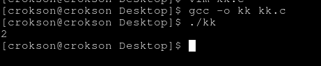
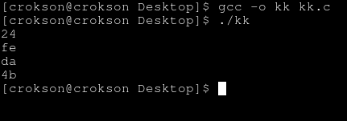

# CSAPP : phép true false boolean dưới dạng mã bit 

> Ngày bắt đầu viết : 7/7/2026

> Ngày hoàn thành : 8/7/2026

**mục lục**

- 1.Phép true false là gì và boolean dưới dạng mã bit là gì

- 1.1.Bốn phép toán Boolean cơ bản trên bit đơn lẻ

- 2.Tác dụng của phép bit boolean so với mảng các biến boolean

- 3.Biểu diễn Tập hợp bằng Bit Vectors

- 3.1.Bit Vectors là gì?

- 3.2.Biểu diễn tập hợp bằng bit vectors

- 4.Mở rộng phép toán Boolean lên Chuỗi Bit (Bit Vectors)

- 4.1.Khái niệm chuỗi bit là gì?

- 4.2.Mở rộng phép toán boolean lên chuỗi bit

- 5.Kết luận

---

## 1.Phép true false là gì và boolean dưới dạng mã bit là gì

- Phép true và false chỉ thị cho việc đúng/sai của chương trình, `ví dụ nếu if(1) -> true`, sẽ thực thi lệnh trong if nhưng `if(0) -> false` sẽ thực thi lệnh trong else

- Boolean là hệ giá trị gồm true và false. Trong máy tính, hai giá trị này thường được biểu diễn bằng bit 1 và 0. Các phép toán bit (&, |, ^, ~) là những phép toán hoạt động trên các bit.

## 2.Tác dụng của phép bit boolean so với mảng các biến boolean

- tác dụng của phép bit boolean là tối ưu hiệu suất, làm cho chương trình nhanh chóng hơn so với mảng các biến boolean như `bool`. Lý do là việc tính các bit với các cổng trực tiếp của CPU nên nó nhanh hơn rất nhiều tuy nhiên điều này ko phải lúc nào cũng có thể xảy ra, compiler có thể tối ưu bool rất tốt và tốc độ gần hoặc bằng

- tiếp theo là tiết kiệm bộ nhớ

## 3.Biểu diễn Tập hợp bằng Bit Vectors

#### 3.1.Bit Vectors là gì?

- Một dãy (sequence/vector) các bit, trong đó mỗi bit biểu diễn trạng thái của một phần tử hoặc một cờ (flag). Mỗi phần tử logic chỉ cần biểu diễn bằng 1 bit, vì vậy bit vector có thể tiết kiệm bộ nhớ hơn so với việc dùng một byte hoặc một biến bool cho mỗi phần tử.

- Bit vector đơn giản là bật cái gì đó lên có thể thôi, nó chỉ được gọi là bit vector khi ta xem bit này là bật cái nào đó thật sự trong hệ thống, chương trình. Ví dụ 001 là execute, 010 là write và 100 là read nó là bit vector

#### 3.2.Biểu diễn tập hợp bằng bit vectors

- mỗi mảng, tập hợp sẽ được biểu diễn dưới dạng bit ví dụ ta có tập hợp S = {A,C,D,G}, ta xem bảng chữ cái tiếng anh được biểu diễn dưới dạng bit vị trí như sau

| bit vị trí | 7 | 6 | 5 | 4 | 3 | 2 | 1 | 0 |
|------------|---|---|---|---|---|---|---|---|
| chữ cái 	 | A | B | C | D | E | F | G | H |
| tập hợp 	 | 1 | 0 | 1 | 1 | 0 | 0 | 1 | 0 |

ta có tập hợp với bit vector là : S = {10110010}

> [!IMPORTANT]
> Điều này nghĩa là : Trong bộ nhớ máy tính, mọi dữ liệu cuối cùng đều được lưu dưới dạng chuỗi bit. Khi biểu diễn dưới dạng bit vector, ta có thể dùng các phep toán AND, XOR v.v. để có thể làm việc, xáo trộn các bit trong. Ta có thể kiểm tra hay làm việc với các phần tử

- Vì sao nhanh hơn rất nhiều so với array, nhưng lại càng phức tạp hơn. Vì nó là bit, phức tạp ở chỗ vẫn là bit, có thể dịch bit hay dùng các phép toán bit khác như Xor, And, Or, Not để xử lý, chỉnh sửa, thêm, xóa v.v. với bit

<details>
	<summary>trực quan với C</summary>

từ tập hơp S = 10110010 , muốn kiểm tra G $$\large\in$$ S ?

```c
#include <stdio.h>
int main(void){
unsigned char S = 0b10110010;

printf("%d\n", S & (1 << 1)); //kết quả là 2
return 0;
}
```



kết quả là 2 $$\large\neq$$ 0, suy ra phần tử G $$\large\in$$ S

- Còn muốn thêm phần tử F? -> dùng `S |= (1 << 2);` , lúc này sẽ thành :

| bit vị trí | 7 | 6 | 5 | 4 | 3 | 2 | 1 | 0 |
|------------|---|---|---|---|---|---|---|---|
| chữ cái 	 | A | B | C | D | E | F | G | H |
| tập hợp 	 | 1 | 0 | 1 | 1 | 0 | 1 | 1 | 0 |

S = 10110110 và F $$\large\in$$ S

</details>

- Ứng dụng của nó: hiện nay nó dùng kiểm tra thanh ghi nào đang rảnh, page map mà OS cấp, permission v.v. với chương trình C thì việc này sẽ thuận tiện nếu làm việc với flags, kiểm tra, thêm, xóa và so sánh, nhiều cái khác nữa. Với writeup này thì chương này có liên quan tới phàn so sánh

## 4.Mở rộng phép toán Boolean lên Chuỗi Bit (Bit Vectors)

#### 4.1.Khái niệm chuỗi bit là gì?

- chuỗi bit là dãy `01001010` ví dụ `0` là chuỗi bit, `0110` là chuỗi bit hoặc dài hơn cỡ nào vẫn là chuỗi bit. Chuỗi bit ko có ý nghĩa , nó tùy vào cách diễn giải. Điều này ta đã thấy ở writeup bù hai hôm trước rồi

#### 4.2.Mở rộng phép toán boolean lên chuỗi bit

- khi ta có a và b đều được gán chuỗi bit, 4 phép tính bit được gọi là boolean cơ bản này `xor, and, or, not` sẽ thực hiện tính toán lên các chuỗi bit 

<details>
	<summary>với C</summary>

```c
#include <stdio.h>
int main(void){
unsigned char a = 0b10110100;
unsigned char b = 0b01101110;

printf("%x\n", a & b);
printf("%x\n", a | b);
printf("%x\n", a ^ b);
printf("%x\n", (unsigned char)~a);
return 0;}
```



thấy có character lạ là do các bit nó là nhị phân nhưng bị đổi cách diễn giải thành hexa vì %x
</details>

- Tại sao gọi là mở rộng ? : lúc đầu, boolean chỉ biểu thị `0` và `1` chỉ là 1 bit, mở rộng sang chuỗi bit là một dãy `100101` và tính toán trong đó

## 5.Kết luận

- phép true false là biểu thị cho đúng, sai

- chuỗi bit là một dãy bit như `100010`

- boolean mở rộng sang chuỗi bit vì lúc đầu boolean chỉ là `0` và `1`, mở rộng là `0101010` tính toán trong chuỗi bit dài đó

- bit vector biểu thị cho các bit `0` và `1` công tăc bật cái gì đó thật sự cho hệ thống, chương trình

- Biểu diễn tập hợp bằng bit vectors là có thể bật tắt trong tập hợp tại một biến, có thể chỉnh sửa thêm xóa v.v. bằng các phép tính bit

- boolean dưới dạng mã bit là quy định `1` là true, `0` là false

- Tác dụng của phép bit boolean so với mảng các biến boolean là nhanh hơn, tiết kiệm hơn đáng kể