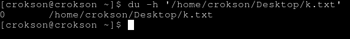
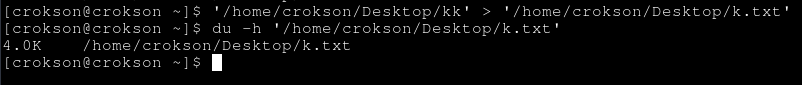
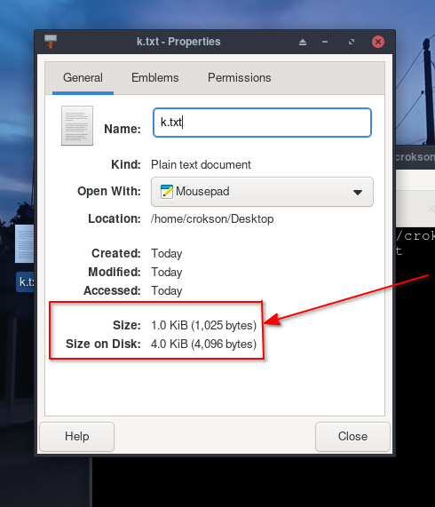
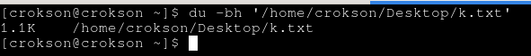
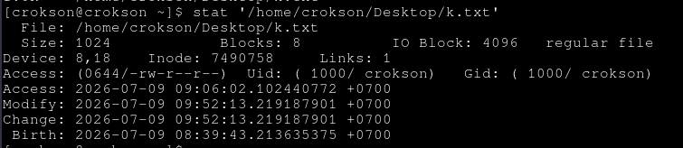
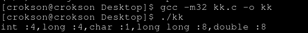
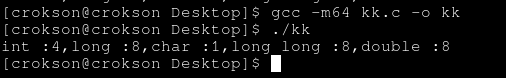

# CSAPP : Data Sizes – Kích thước dữ liệu trong bộ nhớ

> ngày bắt đầu viết : 8/7/2026

> ngày hoàn thành : 

**index**

- [1.data size](#1data-size)

- [1.1.dung lượng là gì?](#11dung-lượng-là-gì)

- [1.2.data size là gì?](#12data-size-là-gì)

- [1.3.khác nhau giữa data size và dung lượng là gì?](#13khác-nhau-giữa-data-size-và-dung-lượng-là-gì)

- [1.4.kích thước trên đĩa (size on disk)](#14kích-thước-trên-đĩa-size-on-disk) 

- [1.5.làm thế nào để biết chính xác file size thực tế?](#15làm-thế-nào-để-biết-chính-xác-file-size-thực-tế)

- [2.word](#2word)

- [2.1.word là gì?](#21word-là-gì)

- [3.sự thay đổi data size của kiểu dữ liệu khi tới kiến trúc (architecture) khác](#3sự-thay-đổi-data-size-của-kiểu-dữ-liệu-khi-tới-kiến-trúc-architecture-khác)

- [3.1.kiến trúc (architecture) là gì?](#31kiến-trúc-architecture-là-gì)

- [3.2.sự thay đổi data size của chương tình, kiểu dữ liệu khi tới kiến trúc khác](#32sự-thay-đổi-data-size-của-chương-tình-kiểu-dữ-liệu-khi-tới-kiến-trúc-khác)

- [3.3.tại sao khi tới kiến trúc khác data size lại thay đổi](#33tại-sao-khi-tới-kiến-trúc-khác-data-size-lại-thay-đổi)

- [3.4.tại sao ko để mọi kiểu tăng lên?](#34tại-sao-ko-để-mọi-kiểu-tăng-lên)

- [5.Alignment và padding](#5Alignment-và-padding)

- 6.Ví dụ thực tế trên IA-32 và x86-64

- 7.Kết luận

---

## 1.data size

#### 1.1.dung lượng là gì?

- Dung lượng (storage capacity) là khả năng lưu trữ tối đa của một thiết bị hoặc vùng nhớ. Có ký hiệu như Mb, Gb, Tb , Pb v.v.

> [!IMPORTANT]
> tuy nhiên khác nhau hệ quy đổi ở 2 hệ. Hệ 1 là SI ở đây 1 KB = 1000 B, còn hệ IEC là 1KiB = 1024 B. Phân biệt ký hiệu in hoa và thường, KB = killobyte, kb = killobit -> KB $$\large\neq$$ kb tương tự với các kiểu dữ liệu khác

#### 1.2.data size là gì?

- là kích thước dữ liệu hoặc kích thước của kiểu dữ liệu trong bộ nhớ. Thường đo bằng byte. Trong C data size thường được xác định bằng toán tử sizeof ví dụ :

```c
sizeof(int)
sizeof(long)
sizeof(struct node)
sizeof(x)
```

#### 1.3.khác nhau giữa data size và dung lượng là gì?

- Data size là kích thước của kiểu dữ liệu hoặc đối tượng trong bộ nhớ. Dung lượng là khả năng lưu trữ tối đa của một thiết bị hoặc vùng nhớ. Ví dụ, kiểu int có size 4byte trong bộ nhớ đó là data size, thiết bị A có ổ hhd là 500GB đó là dung lượng

- data size thường xác định kiểu dữ liệu đó nặng hay nhẹ còn dung lượng là xác định thiết bị đó có thể chứa được bao nhiêu tệp

#### 1.4.kích thước trên đĩa (size on disk)

- khái niệm File size là kích thước của một tệp trên hệ thống tệp. Nó khác với data size của một đối tượng trong RAM, nhưng đều được đo bằng byte.

- Kích thước trên đĩa thường lớn hơn kích thước thực tế của tệp tin, do hệ điều hành lưu trữ dữ liệu theo từng khối (cluster) cố định, ví dụ file_a có file size là 1kb nhưng khi lưu vào ổ cứng chạy hệ điều hành linux hay windows thì nó sẽ lớn hơn. 

- từng khối (cluster) là gì? là đơn vị cấp phát nhỏ nhất của hệ thống tệp (filesystem). Xuống ổ cứng do hệ điều hành thực hiện, ko phải hệ điều hành nào cũng có đơn vị giống nhau nhưng ví dụ file có 1 kb nó cấp phát 4kb thì chỉ lưu 1kb là file size, 3kb Phần dung lượng còn lại trong cluster không thể được file khác sử dụng, nên bị lãng phí nội bộ

<details>
	<summary>ví dụ thực tế</summary>
1 ký tự a là 1 byte, 1KB thường là 1024 byte vậy :

```c
#include <stdio.h>
int main(void){

	int a = 0;
	while ( a < 1024 ){
		printf("a");
		a++;
	}
	return 0;
}
```

> gcc -o kk kk.c

- lúc đầu k.txt là 0:



- nhưng khi cho 1024 chữ a vào tròn 1kb là :

> ./kk > k.txt



- nó đã lên 4kb, thực tế k.txt chỉ chiếm 1kb thôi nhưng do hệ điều hành cấp phát 3Kb theo cluster và nó cực kỳ lãng phí

</details>

#### 1.5.làm thế nào để biết chính xác file size thực tế?

- khá đơn giản, ta click chuột trái vào file cần xem, ấn `Properties` nó có chỉ thị size và size on disk, size là file size gốc của file còn size on disk là data file gốc + cluster:



- nếu muốn terminal linux thì dùng `du -bh` để soi disk usage (dùng nhanh nếu xem sơ qua) hoặc dùng `ls -lh` ví dụ :

> du -bh k.txt



terminal là 1.0kb còn properties là 1.0 kb là 1024 byte dữ liệu

- Nếu muốn xem chi tiết metadata của file như kích thước, số block, inode, quyền truy cập và thời gian thì dùng `stat` :

> stat k.txt 



size = 1024, block = 8 và nhiều info khác

## 2.word

#### 2.1.word là gì?

- là natural data unit (đơn vị dữ liệu tự nhiên) của kiến trúc CPU. Word ko có data size cố định như 16 bit hay 32 bit, ví dụ IA-32 (32bit) word có 32bit là kích thước 4byte và các thanh ghi tổng quát như EAX EBX đều 32bit , nhưng qua X86-64 (64bit) word có 64bit 8byte có thanh ghi RAX, RBX cũng có 64bit 

> [!WARNING]
> Word là kích thước dữ liệu tự nhiên, ko có kích thước cố định trong ngữ cảnh chung của kiến trúc máy tính, CPU architecture

#### 2.2.word dùng để làm gì?

- CPU thường thiết kế ALU, thanh ghi và bus dữ liệu xoay quanh kích thước word. Ví dụ `long x = a + b` trong 64bit architecture , CPU nạp 64bit vào thanh ghi , cộng 64bit và ghi lại 64bit. Nếu dữ liệu đúng bằng word, CPU thường xử lý hiệu quả hơn so với việc phải ghép nhiều lần đọc/ghi các phần nhỏ hơn.

> [!NOTE]
> word ở CPU $$\large\neq$$ word ở assembly, một số hợp ngữ thường dùng word với nghĩa cố định theo quy ước riêng nhưng ko phải định nghĩa chung của kiến trúc máy tính
> ta có thể nhìn word để suy đoán ra số bit mà CPU architecture hỗ trợ hoặc ngược lại, nhìn bit CPU architecture để suy ra bit của word

## 3.sự thay đổi data size của chương trình, kiểu dữ liệu khi tới ngành kiến trúc khác

#### 3.1.kiến trúc (architecture) là gì?

- là những bản thiết kế vận hành của CPU , máy tính. Nó tác động tới tập lệnh, binary, thanh ghi, ABI v.v.

#### 3.2.sự thay đổi data size của chương tình, kiểu dữ liệu khi tới kiến trúc khác

- khi kiểu dữ liệu từ 32bits architecture tới 64bits sarchitecture, có sự biến đổi chênh lệch data size. Vì vậy, khi ta tin tưởng type đó sẽ vẫn là data size khi tới kiến trúc đó là một sai lầm lớn. Proof :

<details>
	<summary>proof</summary>

```c
#include <stdio.h>
int main(void){
	printf("int :%d,long :%d,char :%d,long long :%d,double :%d\n",sizeof(int),sizeof(long),sizeof(char),sizeof(long long),sizeof(double));
	return 0;
}
```

cùng một src code, giờ biên dịch nó với 32bit trước :

> gcc -m32 kk.c -o kk

lưu ý : nhớ tải lib32-gcc-libs, ko thì sẽ lỗi linking do thiếu library động .so

32bits :



64bits :



ta thấy có sự chênh lệch ở kiểu `long`

</details>

#### 3.3.tại sao khi tới kiến trúc khác data size lại thay đổi

- Data size thay đổi vì architecture và ABI quy định kích thước của một số kiểu dữ liệu để CPU và hệ điều hành hoạt động hiệu quả hơn. Hơn nữa, compler và ABI thay đổi làm sizeof thay đổi data size của type, do ABI quyết định. 

- Còn proof?, đã có ở đợt chứng minh vừa rồi với C, ta dùng gcc -m32 và -m64 biên dịch và chạy cùng một CPU architecture nhưng long vẫn thay đổi sizeof điều đó ko phải do CPU architecture làm, do ABI làm

- Mọi src C khi biên dịch ko còn là type, theo góc nhìn của reverse nó là access thanh ghi với offset, nếu là 32bits mọi thanh ghi có thể được dùng $$\large\in$$ [4,32] bits tương tự với 64bits

#### 3.4.tại sao ko để mọi kiểu tăng lên?

- Vì tiết kiệm bộ nhớ, ví dụ `int` có data size là 4byte nhưng hàng triệu program đều dùng nó nhìn 4byte 1 program thì ít nhưng nhân với cả triệu thì đó là câu chuyện khác. Phần lớn số nguyên thường len lỏi khá ít, check error, condiction, xấp xỉ phạm vi [0,16] bits hiếm ai dùng cả chục tỷ cho project trong một biến

- Tăng lên ở long, long long là khi ai muốn dùng số lớn là dùng type long còn ko thì int. Tăng lên mọi kiểu như int, double v.v. chỉ tốn ram mà int tăng ngang long chả khác gì mấy kiểu kia xây lên để chơi chỉ thay tên cho đẹp à?

- nên nó chỉ tăng long và pointer nếu LP64 linux còn LPP64 windows thì long giữ nguyên, tăng pointer

## 5.Alignment và padding

- Alignment là cái dùng để chia hết, vì CPU hoạt động theo lô nó luôn lấy một lượng byte ví dụ 4 - 8 byte trong một lần. Ví dụ, ta khai báo kiểu int nó phải chia hết cho data size của int `sizeof(int)` để tối ưu hiệu suất. Như thế, CPU mới lấy vừa đủ lô vì nó chia hết

- Padding là thêm các ký tự điển hình null byte, nếu ko chia hết cho alignment ,system thực hiện padding thêm cho đủ để chia hết. Ví dụ, khai báo kiểu int mà ko chia hết cho 4, system sẽ thực hiện padding sao cho chia hết cho 4

> [!NOTE]
> Alignment : a $$\large\mid$$ b , a là dữ liệu, b là data size (sizeof)
> Padding : (a + null byte (\0) ) $$\large\mid$$ b , điều kiện a $$\large\nmid$$ b và padding < data size