# CSAPP : Floating point numbers - IEEE 754 (số thực dấu phẩy động chuẩn IEEE 754)

> Ngày bắt đầu viết : 13/7/2026

> Ngày hoàn thành :

**mục lục**

**Phần trọng tâm**

- [1.Tổng quan về IEEE 754](#1Tổng-quan-về-ieee-754)

    - [1.1.Chuẩn hóa số thực (normalized)](#11Chuẩn-hóa-số-thực-normalized)

    - [1.2.Khử chuẩn hóa số thực (Denormalized)](#12khử-chuẩn-hóa-số-thực-denormalized)

       - [1.2.1.Khi nào IEEE 754 sử dụng Normalized và Denormalized?](#122Khi-nào-ieee-754-sử-dụng-normalized-và-denormalized)

    - [1.3.Vô hạn (infinity)](#13Vô-hạn-infinity)

    - [1.4.ko phải một số (NaN)](#14ko-phải-một-số-nan)

       - [1.4.1.Quite NaN (qNaN)](#141quite-nan-qnan)

       - [1.4.2.Signaling NaN (sNaN)](#142signaling-nan-snan)

    - [1.5.zero](#15zero)

    - [1.6.scanf và các hàm lệnh đọc khác có thể đọc các chỉ thị nan, infinity](#16scanf-và-các-hàm-lệnh-đọc-khác-có-thể-đọc-các-chỉ-thị-nan-infinity)

    - [1.7.Trường Fraction (phần trị - significand)](#17trường-fraction-phần-trị---significand)

       - [1.7.1.Hidden Bit](#171hidden-bit)

    - [1.8.Trường số mũ (Exponent)](#18Trường-số-mũ-exponent)

       - [1.8.1.Độ lệch (Bias)](#181độ-lệch-bias)

    - [1.9.Trường số dấu (signed)](#19trường-số-dấu-signed)

- [2.Chuyển đổi số thực sang hệ nhị phân và chuyển đổi hệ nhị phân sang số thực](#2chuyển-đổi-số-thực-sang-hệ-nhị-phân-và-chuyển-đổi-hệ-nhị-phân-sang-số-thực)

    - [2.1.Encode](#21encode)

       - [2.1.1.Chuyển phần nguyên sang nhị phân](#211chuyển-phần-nguyên-sang-nhị-phân)

       - [2.1.2.Chuyển phần thập phân sang nhị phân](#212chuyển-phần-thập-phân-sang-nhị-phân)

       - [2.1.3.Chuẩn hóa số thực](#213chuẩn-hóa-số-thực)

       - [2.1.4.Tính Exponent Field](#214tính-exponent-field)

       - [2.1.5.Lấy Fraction](#215lấy-fraction)

       - [2.1.6.Ghép Sign | Exponent | Fraction](#216ghép-sign--exponent--fraction)

    - [2.2.Decode](#22decode)

       - [2.2.1.Tách Sign | Exponent | Fraction](#221tách-sign--exponent--fraction)

       - [2.2.2.Khôi phục Actual Exponent](#222khôi-phục-actual-exponent)

       - [2.2.3.Khôi phục Hidden Bit](#223khôi-phục-hidden-bit)

       - [2.2.4.Nhân với 2^Exponent](#224nhân-với-2exponent)

       - [2.2.5.Áp dụng Sign](#225áp-dụng-sign)

       - 2.2.6.Phân biệt giữa exponent để tính trọng số bit fraction và exponent biểu thị cho dịch dấu chấm

    - [2.3.Số thực lớn nhất và tính toán số thực lớn nhất (Largest finite)](#23số-thực-lớn-nhất-và-tính-toán-số-thực-lớn-nhất-largest-finite)

    - [2.4.Số thực chuẩn hóa nhỏ nhất và tính toán số thực chuẩn hóa nhỏ nhất (Smallest normalized)](#24số-thực-chuẩn-hóa-nhỏ-nhất-và-tính-toán-số-thực-chuẩn-hóa-nhỏ-nhất-smallest-normalized)

    - [2.5.Số thực khử chuẩn hóa nhỏ nhất và tính toán số thực khử chuẩn hóa nhỏ nhất (Smallest subnormal)](#25số-thực-khử-chuẩn-hóa-nhỏ-nhất-và-tính-toán-số-thực-khử-chuẩn-hóa-nhỏ-nhất-smallest-subnormal)

    - [2.6.Số thực lớn nhất trong miền khử chuẩn hóa (Largest subnormal)](#26số-thực-lớn-nhất-trong-miền-khử-chuẩn-hóa-largest-subnormal)

- [3.Rounding tổng quan và các chế độ làm tròn](#3rounding-tổng-quan-và-các-chế-độ-làm-tròn)

    - [3.1.biểu diễn nhị phân hữu hạn và biểu diễn nhị phân vô hạn](#31biểu-diễn-nhị-phân-hữu-hạn-và-biểu-diễn-nhị-phân-vô-hạn)

    - [3.2.Round to nearest, ties to even](#32round-to-nearest-ties-to-even)

       - [3.2.1.guard bit](#321guard-bit)

       - [3.2.2.round bit](#322round-bit)

       - [3.2.3.sticky bit](#323sticky-bit)

       - [3.2.4.cách phần cứng dùng các guard bit, round bit và sticky bit để xác định ba trường hợp](#324cách-phần-cứng-dùng-các-guard-bit-round-bit-và-sticky-bit-để-xác-định-ba-trường-hợp)

       - [3.2.5.Thao tác Bitwise Raw Manipulation trên uint32_t](#325thao-tác-bitwise-raw-manipulation-trên-uint32_t)

       - [3.2.6.Vì sao phần cứng biết vị trí của Guard, Round và Sticky Bit?](#326vì-sao-phần-cứng-biết-vị-trí-của-guard-round-và-sticky-bit)

    - [3.3.Round toward zero](#33round-toward-zero)

       - [3.3.1.biểu diễn làm tròn trên hệ nhị phân](#331biểu-diễn-làm-tròn-trên-hệ-nhị-phân)

    - 3.4.Round toward positive infinity (+∞)

    - 3.5.Round toward negative infinity (−∞)

- 4.kết luận

**Phần mở rộng**

- 1.Những vấn đề thường gặp khi làm việc với số thực

    - 1.1.Underflow

    - 1.2.Overflow

    - 1.3.Precision Loss

    - 1.4.Catastrophic Cancellation

    - 1.5.Floating-point comparison

    - 1.6.Gradual underflow

---

# Phần trọng tâm

## 1.Tổng quan về IEEE 754.

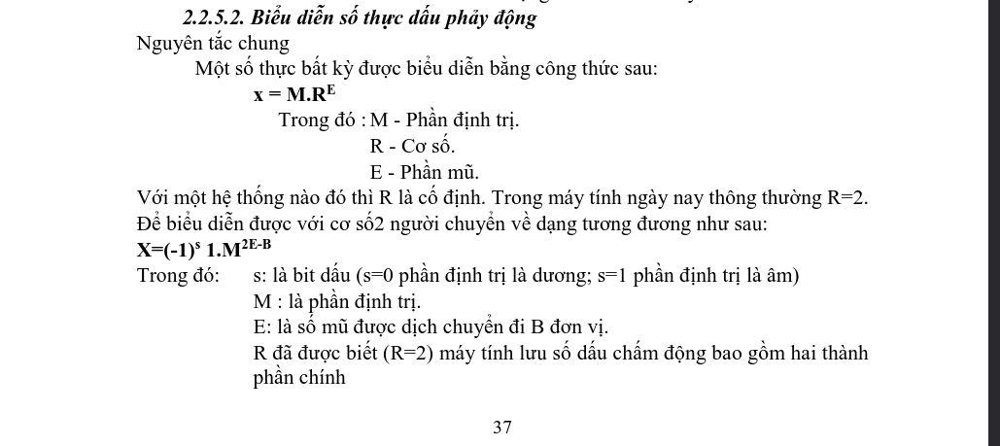

> Ko phải CS:APP, tham khảo từ cuốn kiến trúc máy tính vì tính dễ hiểu về formula

- `Số thực IEEE 754` là quy tắc biểu diễn số thực cho thiết bị nhị phân (máy tính) thế giới. **Formula tổng quan là** $$\Large(-1)^{S} \times 1.m \times 2^{e-b}$$, trong đó :

S : là bit dấu, viết tắt sign

m : hidden bit + fraction là phần trị (trường dãy số sau dấu chấm của số thực sau khi đã chuẩn hóa)

e : là giá trị của trường exponent

b : là độ lệch, viết tắt bias

- Ta có một structure của cái này như sau:

| S (sign) | E (Exponent) | m (Fraction) |
|----------|--------------|--------------|

#### 1.1.Chuẩn hóa số thực (normalized)

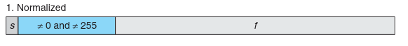

> Trích từ CS:APP

- **chuẩn hóa là gì?** : giống toán học, **formula =**$$\large1.xxxxx\times2^{N}$$ **ví dụ** $$\large12345_{10}$$ = $$\large1.2345_{10}\times10^{4}$$ số mũ là 4 vì dịch dot sang trái 4 lần hoặc $$\large0.00123_{10}$$ = $$\large1.23\times10^{-3}$$ số mũ là -3 vì dịch dot sang phải 3 lần. Đó gọi là dạng chuẩn hóa

IEEE 754 cũng làm thế, cơ mà nó biểu diễn dạng binary và dùng cơ số 2. **Ví dụ**, $$\large13.25_{10} = 1101.01_{2}$$, di chuyển dấu chấm sao cho trước dấu chấm chỉ còn đúng một bit 1 ta có $$\large1.10101_{2}$$ số lần di chuyển là 3 vì :

```
lúc đầu : 1101.01
di chuyển dot 1 lần : 110.101
di chuyển dot 2 lần : 11.0101
di chuyển dot 3 lần : 1.10101
Tổng cộng dịch dấu chấm 3 lần để trước dấu chấm chỉ còn đúng một bit 1.
```

Vậy nên ta có số mũ là 3, suy ra $$\large1.10101_{2}\times2^{3}$$ và khi tính lại là $$\large1.10101_{2}\times2^{3} = 1101.01_{2}$$ ta thấy nó lại di chuyển về từ đầu. Vậy cho ví dụ khi số mũ âm, cho số $$\large0.1_{2} = 0.5_{10}$$ bây giờ muốn đưa về dạng $$\large1.xxxxx\times2^{N}$$, ta cần phải dịch dấu chấm sang phải một lần, ta có $$\large1.0_{2}$$ lúc này số mũ sẽ là `negative 1 (âm 1)` nên result là $$\large1.0_{2}\times2^{-1}$$

Bây giờ ta có $$\large1.0_{2}\times2^{-1}$$ tính ngược lại ta dùng phép chia, $$\large1.0_{2}\times2^{-1} = 1.0_{2}\div2 = 0.1_{2}$$ và nó đúng với số ban đầu vì sao? Vì $$\large2^{-1}=\frac{1}{2}$$ nên nhân với $$\large2^{-1}$$ tương đương chia cho 2

> [!IMPORTANT]
> nếu số mũ âm $$\large2^{-N}$$ ta dùng phép chia cho $$\large2^{N}$$, nếu số mũ dương $$\large2^{N}$$ ta dùng phép nhân cho $$\large2^{N}$$
>
> nếu dịch dot sang trái số mũ là **số dương** và dịch dot sang phải thì số mũ sẽ là **số âm**. Độ lớn tuyệt đối của số mũ (|N|) bằng số lần dịch dấu chấm. Dấu của số mũ phụ thuộc vào hướng dịch, nó lớn theo âm-dương **ví dụ** dương lớn dần sẽ là `1,2,3,4,..` còn âm nhỏ dần sẽ là `-1,-2,-3,-4,..`
>
> Trong IEEE 754 (đối với các số normalized), sau khi chuẩn hóa, biểu diễn luôn có dạng: $$\large1.xxxxx\times2^{N}$$ .Nghĩa là trước dấu chấm luôn chỉ có đúng một bit 1. Chính vì bit đầu tiên luôn là 1, IEEE 754 không cần lưu bit này vào bộ nhớ (hidden bit), chỉ lưu phần phía sau dấu chấm trong trường Fraction.

<details>
	<summary>tại sao phải chuẩn hóa số thực?</summary>

- Vì nếu ko chuẩn hóa mọi số thực sẽ có cùng value nhưng nhiều cách biểu diễn sẽ khác nhau **ví dụ** $$\large1001.1_{2}\times2$$, $$\large100.11_{2}\times2^{1}$$, $$\large10.011_{2}\times2^{2}$$, $$\large1.0011_{2}\times2^{3}$$. Cùng giá trị nhưng dịch dot khác biểu diễn. Nên IEEE quy định sử dụng dạng $$\large1.xxxxx\times2^{N}$$ để mỗi số chỉ có một biểu diễn duy nhất. Ngoài ra, vì bit đầu tiên luôn là 1, CPU không cần lưu bit này (gọi là hidden bit hoặc implicit leading 1), nhờ đó tăng thêm một bit độ chính xác cho trường Fraction.

</details>

#### 1.2.Khử chuẩn hóa số thực (Denormalized)

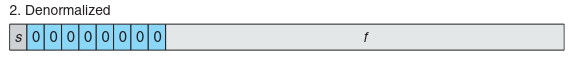

> trích từ CS:APP

- Là việc bit đầu tiên là 0 nhưng nó thực hiện phép toán $$\large0.xxxxx\times2^{1-bias}$$. **Lúc này** hiddenbit ko còn là 1 nữa, nó là 0 và exponent field luôn là 0. Giả sử float (32bits) ta có :

```
Exponent = 00000000
Fraction = 00000000000000000000001
```

thì đây ko phải là parent $$\large1.0000000000_{2}\times2^{127}$$ mà là $$\large0.0000000000000000000001_{2}\times2^{-126}$$ vì hiddenbit đã bằng 0. **Vậy vì sao phải làm như vậy?**, ta biết normalized nó sẽ có bit đầu luôn là 1, exponent của nó là dương hay âm tùy thuộc vào cách dịch dấu chấm là trái hay phải ,nhưng điều gì sẽ xảy ra nếu số thực cực kỳ nhỏ **ví dụ** $$\large2^{-150}$$ hay $$\large0.000000000000000000000001_{2}$$, nếu vẫn cố chuẩn hóa về $$\large1.xxxxx\times2^{N}$$ thì kết quả sẽ bị underflow tức là bị làm tròn thành 0

> [!IMPORTANT]
> Đối với normalized numbers, IEEE754 dùng $$\large1.xxxxx\times2^{N}$$ nên số đầu tiên luôn là 1
>
> Còn với Denormalized numbers, IEEE754 dùng $$\large0.xxxxx\times2^{1 - Bias}$$ nên `exponent field = 0` và hiddenbit được xem là 0. Khử chuẩn hóa được thiết kế để biểu diễn với số gần 0 nhất **tránh bị underflow** quá sớm

#### 1.2.1.Khi nào IEEE 754 sử dụng Normalized và Denormalized?

- `Normalized` được ưu tiên khi biểu diễn số thực vì dạng này tận dụng hiddenbit, giúp tăng thêm một bit chính xác, dùng cho hầu hết các số thực 

- Nếu `normalized` không biểu diễn được nhưng vẫn còn nằm trong phạm vi **subnormal** mới được chọn tới `denormalized` để biểu diễn các số sát `0` nhất có thể. Tuy nhiên độ chính xác sẽ thấp hơn, dùng cho số rất nhỏ gần sát `0`

> [!IMPORTANT]
> `Normalized` được IEEE ưu tiên vì độ chính xác cao hơn, tận dụng hiddenbit với dạng $$\large1.xxxxx\times2^{N}$$. Nhưng nếu số quá nhỏ cần phải dùng tới `Denormalized` với dạng $$\large0.xxxxx\times2^{1 - bias}$$ , điều này giúp biễu diễn các số sát `0` nhất có thể, tuy nhiên độ chính xác thấp hơn.
>
> Nếu `Denormalized` ko thể sử dụng được nữa (nhỏ hơn cả subnormal nhỏ nhất) thì gía trị số thực sẽ bị underflow và kết quả sẽ thành `0`

#### 1.3.Vô hạn (infinity)

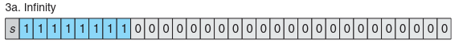

> Trích từ CS:APP

- Trong IEEE chuẩn còn định nghĩa là dương vô cực ($$\large+\infty$$) và âm vô cực ($$\large-\infty$$), infinity xuất hiện khi kết quả của một phép tính vượt quá phạm vi biểu diễn của kiểu số thực. **Ví dụ** biểu thức cho float (32bits) $$\large3.5\times10^{38}\times10 = +\infty$$ với giá trị của biểu thức vừa rồi lớn hơn giá trị float lớn nhất (số thực lớn nhất) nên nó sẽ là dương vô cực ($$\large+\infty$$) vì `sign = 0` là số dương. Phần số thực lớn nhất ở mục [2.3.Số thực lớn nhất và tính toán số thực lớn nhất (Largest finite)](#3số-thực-lớn-nhất-và-tính-toán-số-thực-lớn-nhất)

- IEEE 754 quy định Infinity có dạng:

| Sign | Exponent | Fraction |
|------|----------|----------|
| 0 hoặc 1 | Toàn bộ bit = 1 | Toàn bộ bit = 0 |

nếu `sign = 0` : dương vô cực $$\large+\infty$$

nếu `sign = 1` : âm vô cực $$\large-\infty$$

> [!IMPORTANT]
>
> Infinity **không phải là số lớn nhất** mà là một giá trị đặc biệt dùng để biểu diễn kết quả vượt quá phạm vi của kiểu số thực.
>
> Điều kiện nhận biết Infinity là:
>
> - Exponent Field = tất cả bit 1.
> - Fraction = tất cả bit 0.

<details>
	<summary>ví dụ với C</summary>

- Cho đoạn C sau :

```c
#include <stdio.h>

int main(void){
	float a = 1e39f
	printf("%f\n",a);
	return 0;
}
```

> gcc -o float_infinity float_infinity.c

khi compiled ra ta thấy compiler nó cảnh baó với info `warning: floating constant exceeds range of ‘float’ [-Woverflow]` đó là chúng ta cần test, bây giờ chạy thử :

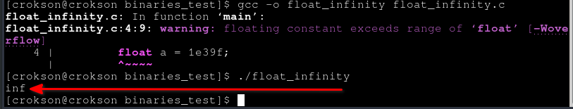

ta thấy hiện `inf` nghĩa là dương vô cực $$\large+\infty$$

</details>

#### 1.4.ko phải một số (NaN)

#### 1.4.1.Quite NaN (qNaN)

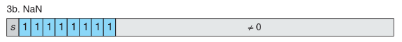

> trích từ CS:APP

- là một giá trị đặc biệt, chỉ thị cho không xác định hoặc số đó ko phải là số thực $$\large\frac{0}{0} = \text{NaN}$$, $$\large\infty-\infty=\text{NaN}$$, $$\large\sqrt{-1}=\text{NaN}$$ (đối với số thực). IEEE 754 quy định NaN có dạng như :

| Sign | Exponent | Fraction |
|------|----------|----------|
| 0 hoặc 1 | Toàn bộ bit = 1 | Khác 0 |

Nghĩa là Exponent phải là tòan bộ bit là một và Fraction phải có ít nhất một bit khác 0 cấu trúc như trong image trên từ CS:APP

> [!IMPORTANT]
> NaN chỉ xảy ra khi exponent toàn bộ bit phải là 1 và frantion $$\large\neq$$ 0
>
> Điểm cần phân biệt :
> - Fraction = 0 : infinity ($$\large+\infty$$, $$\large-\infty$$)
> - Fraction $$\large\neq$$ 0 : NaN

NaN có tính chất đặc biệt là **ko bằng bất kỳ giá trị nào kể cả chính nó**, trong dãy fraction phần bit có trọng số cao nhất của dãy bit fraction là `Quite bit` minh họa với 32bit(float) :

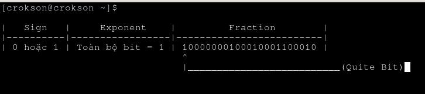

Trong đó QuiteBit là phần có thể là `0` hoặc `1`, khi quite bit là `1` thì đó gọi là Quite NaN là cái mà chúng ta đang nói ở chương này, còn khi QuiteBit là `0` thì đó gọi là Signaling NaN (sNaN), là cái mà chúng ta sẽ nói ở chương [1.4.2.Signaling NaN (sNaN)](#142signaling-nan-snan) tiếp theo

> [!IMPORTANT]
> Bit có trọng số cao nhất trong dãy fraction luôn là quitebit (khi toàn bộ bit kế tiếp đều là 1) thỏa điều kiện để xem đó là NaN:
> - nếu quite bit = 1 đó là qNaN (quite NaN)
> - nếu quite bit = 0 đó là sNaN (Signaling NaN)

<details>
	<summary>Ví dụ với C</summary>

- Cho đoạn C sau :

```c
#include <math.h>
#include <stdio.h>

int main(void){
	double x = NAN;
	printf("dounle NaN x == x is : %d\n",x == x); // kết quả là 0
	printf("dounle NaN x != x is : %d\n",x != x); // kết quả là 1
	printf("dounle NaN x < x is : %d\n",x < x); // kết quả là 0
	printf("dounle NaN x > x is : %d\n",x > x); // kết quả là 0
	return 0;
}
```

> gcc -o Double_NaN Double_NaN.c

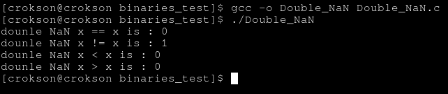

**Vì sao nó lại ra 0?:** Theo chuẩn IEEE 754, mọi phép so sánh bằng (==) với NaN đều trả về false, kể cả khi so sánh chính nó. `0` và `1` được xem làm gía trị boolean true false trong việc này. Ở đây so sánh `x == x` vốn dĩ x lại là NaN nên giá trị là `False = 0`. Điều này cũng như vậy với phép so sánh khác như lớn hơn, bé hơn, lớn hơn hoặc bằng và bé hơn hoặc bằng trừ các hàm chuyên biệt như `isnan()`

Điều này khiến việc kiểm tra NaN phải dùng hàm `isnan()` trong `<math.h>` thay vì toán tử `==`.

</details>

Nếu trong condition ta thấy `if(x != x)` thì điều đó chỉ đúng khi `x = NaN` vì NaN là thứ duy nhất giúp `x != x` trả true. Đây là một mẹo thường gặp trong các câu hỏi về C, compiler và IEEE 754. Vì NaN là giá trị duy nhất mà biểu thức `x != x` luôn đúng, một số mã nguồn hoặc trình biên dịch có thể dùng tính chất này để phát hiện NaN.

#### 1.4.2.Signaling NaN (sNaN)

Đây cũng là loại bit đặc biệt NaN chỉ khác với qNaN là nó dùng để báo hiệu rằng chương trình vừa sử dụng một giá trị ko hợp lệ hoặc chưa được khởi tạo. Khác với quiet NaN, sNaN không âm thầm lan truyền, mà sẽ cố gắng tạo ra một floating-point invalid exception ngay khi được sử dụng trong phép toán.

IEEE quy định sNaN phải thỏa điều kiện xảy ra NaN là exponent field phải hết tất cả bit đều là 1, và fraction phải khác 0 tuy nhiên sNaN nên quiet bit là 0 đó là điều kiện để xảy ra sNaN.

> [!IMPORTANT]
> sNaN được tạo ra để phát hiện lỗi sớm. Khi CPU hoặc FPU sử dụng sNaN trong một phép toán, chuẩn IEEE 754 cho phép phần cứng phát sinh Invalid Operation Exception. Sau đó, trên nhiều kiến trúc, giá trị này sẽ được chuyển thành Quiet NaN (qNaN) để tiếp tục lan truyền qua các phép tính tiếp theo.

<details>
	<summary>ví dụ sNaN với C</summary>

```c
#include <stdio.h>
#include <stdint.h>
#include <string.h>

int main(void){
    uint32_t raw = 0x7F800001; // sNaN (theo IEEE754)
    float x;
    memcpy(&x, &raw, sizeof(x));
    printf("%f\n", x);
    return 0;
}
```

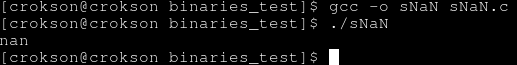

Khác với NAN (thường là Quiet NaN), ngôn ngữ C không cung cấp sẵn một hằng Signaling NaN. Muốn tạo sNaN, lập trình viên phải xây dựng trực tiếp mẫu bit IEEE754 (bit pattern) bằng các kỹ thuật như memcpy hoặc union. Tuy nhiên, trên nhiều hệ thống, sNaN sẽ nhanh chóng được phần cứng chuyển thành Quiet NaN khi tham gia phép toán.

</details>

#### 1.5.Zero

trong toán học giá trị `0` gần như bằng nhau nhưng trong biểu diễn số thực chuẩn IEEE754 dạng bit nhị phân nó lại biểu diễn khác ở phần sign. Ví dụ float (32bit) khi ta gắn gía trị `-0` thì biễu diễn tất cả các bit là 0 trừ sign là 1, nhưng gắn giá trị `+0` thì biễu diễn tất cả các bit là 0 và sign cũng ko ngoại lệ. $$\large\pm0$$ trong biểu diễn số thực ở máy tính là âm hay dương tùy vào sign là 1 hay 0

> [!IMPORTANT]
> Trong IEEE biểu diễn dưới dạng bit thì giá trị `0` :
> - Exponent = 0
> - Fraction = 0
> - Sign = 1 hoặc 0

dù vậy nhưng nó vẫn quy định `+0 == -0` vẫn phải True. Tuy nhiên trong một phép toán, dấu của số 0 vẫn đươc bảo toàn ví dụ như $$\large\frac{1}{+0}=+\infty$$ hay $$\large\frac{1}{-0}=-\infty$$ . Nhờ vậy, CPU vẫn có thể xác định hướng mà một giá trị tiến tới 0 trong nhiều phép tính số học.

**Vì sao nó phải làm vậy?:** Ở đây, $$\large x -> 0^{-}$$ (tiến tới 0 từ phía âm) và $$\large x -> 0^{+}$$ (tiến tới 0 từ phía dương). Và trong giải tích hai giới hạn này khác nhau ở nhiều hàm ví dụ $$\large\frac{1}{x}$$ ở đây khi x tiến tới 0 từ phía âm ($$\large x -> 0^{-}$$) thì giá trị sẽ là âm vô hạn ($$\large-\infty$$) còn nếu khi x tiến tới 0 từ phía dương ($$\large x -> 0^{+}$$) thì giá trị sẽ là dương vô hạn ($$\large+\infty$$) IEEE quy định giữ lại dấu của giá trị `0` để phần cứng có thể phân biệt hai trường hợp này và cho ra kết quả đúng

<details>
	<summary>ví dụ với C</summary>

- cho đoạn C sau :

```c
#include <stdio.h>

int main(void){
	float x = 1 / 0; //chia cho +0
	float y = 1 / -0; // chi cho -0

	printf("1 / +0: %f\n 1 / -0: %f\n",x,y);
	return 0;
}
```

> gcc -o zero zero.c

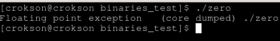

ta thấy khi runtime program, nó trả SIGFPE vậy lỗi này ko phải SIGSEGV (truy cập vaddr ko hợp lệ) **vậy nó là gì?**, tuy nó là có tên gọi là Floating-Pointing (FP) số thực dấu phẩy động nhưng thực chất lỗi này đại diện cho tất cả phép toán ko phù hợp kể cả các lỗi tràn số (overflow) nghiêm trọng hoặc dùng phép tính như chia cho 0, căn bậc hai của một số âm mà ko dùng thư viện số phức hay kết quả tính toán số thực ko xác định. Ta cần sửa lại đoạn C thành:

```c
#include <stdio.h>

int main(void){
	float x = 1.0f / 0.0f; //chia cho +0
	float y = 1.0f / -0.0f; // chi cho -0

	printf("1 / +0: %f\n 1 / -0: %f\n",x,y);
	return 0;
}
```

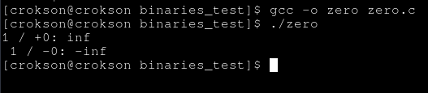

Đây là kết quả chính xác của phép $$\large x -> 0^{-} = -\infty$$ (tiến tới 0 từ phía âm) và $$\large x -> 0^{+} = +\infty$$ (tiến tới 0 từ phía dương) và $$\large\frac{1}{-0} = -\infty$$, $$\large\frac{1}{+0} = +\infty$$

**Vì sao khi chia cho 0 ở số thực này nó lại ko bắn SIGFPE?:** Vì đây là phép chia dấu phẩy động CPU sẽ dùng FPU/SSE (divss, divsd,.. ) để thực hiện điều đó là tập lệnh phù hợp cho phép chia trong trường hợp này nên nó sẽ ko gây ra lỗi gì

Lưu ý: trong C, phép chia số nguyên cho 0 trong C là undefined behavior (UB), trên linux CPU thực hiện lệnh idiv hoặc div và phần cứng sinh lỗi divide error exception nếu (#DE) nếu thấy chia cho 0 và kernel nhận exception này rôi gửi SIGFPE

</details>

#### 1.6.scanf và các hàm lệnh đọc khác có thể đọc các chỉ thị nan, infinity

Trong C, các hàm như scanf có thể đọc các chỉ thị nan, infinity ko chỉ là số thực. **Ví dụ** đọc dữ liệu đầu vào bằng `scanf()` và gán cho số thực, nó ko chỉ đọc số thực nó còn đọc cả `nan, NaN, NAN, +nan, -nan, inf, infinity, -INF`. phần ví dụ có thể xem [tại đây](https://github.com/tranquanghao708/Solve-CaptureTheFlags/blob/main/thecommenter/chall12/writeup.md)

#### 1.7.Trường Fraction (phần trị - significand)

- Là trường lưu các bit phía sau dấu chấm của số nhị phân sau khi đã chuẩn hóa số thực theo dạng chuẩn hóa $$\large1.xxxxx\times2^{N}$$:

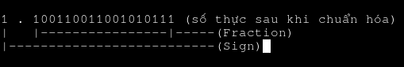

Trường Fraction quyết định precision (độ chính xác) của số thực. IEEE 754 càng dành nhiều bit cho trường Fraction thì càng biểu diễn được nhiều chữ số có nghĩa hơn. Lúc này, độ chính xác vì thế mà tăng. 

- **Điểm thường bị nhầm :** Values trong fraction $$\large\neq$$ độ chính xác. Cái quyết định độ chính xác là số lượng bit được cấp cho trường Fraction

#### 1.7.1.Hidden Bit

Hidden Bit giúp IEEE 754 chỉ lưu 23 bit fraction (float) nhưng lại đạt độ chính xác tương đương 24 bit, hay 52 bit (double) nhưng tương đương 53 bit. Trong số thực IEEE 754 chuẩn hóa (Normalized), bit 1 đứng trước dấu chấm nhị phân không được lưu vào bộ nhớ. Bit này được phần cứng tự động khôi phục khi thực hiện tính toán, nên được gọi là Hidden Bit, Implicit Leading Bit hoặc Implicit 1.

Sự phân biệt giữa hiddenbit và sign bit, khi nhắc tới đứng trước dấu chấm điều dễ nhầm nhất là hai khái niệm sign bit và hiddenbit tuy nhiên chúng không phải chung một khái niệm, phân biệt hidden bit khi thấy bit đứng trước dấu chấm (phải có dấu chấm) đối với số chuẩn hóa mới gọi là hidden bit còn phân biệt sign bit khi thấy bit không đứng trước dấu nào mà là bit MSB (bit có trọng số cao nhất) sau khi thực hiện ráp lại theo cấu trúc `sign | exponent | fraction` chuẩn IEEE đó mới gọi là sign bit. Tuy hai bit đều có toán hạng là 1 bit nhưng về mặt lý thuyết và kỹ thuật chúng phục vụ cho mục đích khác nhau

mục đích của hidden bit là giúp tăng độ chính xác của số thực, ví dụ nó lưu 23bit fraction float nhưng có độ chính xác tương đương với 24bit, điều này giúp tăng độ chính xác cao hơn. Còn mục đích của sign bit là giúp biểu diễn số thực là âm hay dương (Hai khái niệm này cần phân biệt rõ)

Bây giờ để hiểu rõ hiddenbit hơn ta cho **ví dụ** $$\large1.101001_{2}​\times2^{5}$$ trong bộ nhớ IEEE nó ko lưu hiddenbit (bit trước dấu chấm) nó chỉ lưu phần phía sau dấm chấm (phần fraction) Khi FPU đọc giá trị này (giá trị trong bộ nhớ), phần cứng sẽ tự thêm lại bit 1 lúc đso nó lại thành $$\large1.101001_{2}$$ do đó gía trị dung để tính toán là $$\large1.101001_{2}​\times2^{5}$$

**Vì sao IEEE ko lưu hiddenbit?**

mục đích chính là không lãng phí một bit luôn luôn bằng 1, vì khi đối với số thực đã chuẩn hóa thì hidden bit luôn là 1 và nó không bao giờ bằng 0 nếu lưu bit này sẽ lãng phí 1 bit nên IEEE quy định không lưu bit 1 đầu tiên, khi cần sử dụng thì FPU sẽ tự thêm lại. Thực chất hiddenbit không tự động là giúp số thực chính xác hơn tương đương với hơn một bit, cái làm tăng chính xác là khi đưa vào bộ nhớ hiddenbit bị loại bỏ và dùng vùng đó cho các bit có tác dụng, hidden bit chỉ phục vụ cho việc tính toán

Nhưng hidden bit không phải lúc nào cũng bằng 1, nó chỉ đúng với số khi chuẩn hóa (normalized) nhưng đối với số khử chuẩn hóa (denormalized) hidden bit là 0 còn với giá trị đặc biệt như nan hay infinity thì chúng ko có hiddenbit đối với `hiddenbit = 0`, cho **ví dụ** số thực có dạng $$\large0.fraction\times2^{1-bias}$$ và `fraction = 100100... , exponent = 00000000` thì lúc này các kết quả số thực sẽ có dạng `0.100100...` chứ ko phải `1.100100...`. Đây gọi là [khử chuẩn hóa số thực (Denormalized)](#111khử-chuẩn-hóa-số-thực-denormalized) là cơ chế giúp IEEE 754 biểu diễn được các số rất nhỏ gần bằng 0 mà không bị nhảy đột ngột từ số chuẩn hóa nhỏ nhất xuống 0.

| Loại số                  | Hidden Bit    |
| ------------------------ | ------------- |
| Normalized               | 1 (Implicit)  |
| Denormalized (Subnormal) | 0             |
| Infinity                 | Không sử dụng |
| NaN                      | Không sử dụng |

#### 1.8.Trường số mũ (Exponent)

- Là trường biểu diễn số mũ của số thực sau khi chuẩn hóa. Số mũ được xác định bằng số lần dịch dấu chấm để đưa số về dạng $$\large1.xxxxx\times2^{N}$$, **ví dụ** $$\large101.00110_{2} = 1.0100110_{2}$$ dịch chuyển dot sang trái 2 lần số mũ = 2 (dương), $$\large0.00110_{2} = 001.00110_{2} = 1.00110_{2}$$ dịch chuyển dot sang phải 3 lần số mũ = -3 (âm), rõ hơn đã nói trước ở [1.1.Chuẩn hóa số thực](#11Chuẩn-hóa-số-thực)

- Exponent đóng vai trò quyết định độ lớn của số thực, **ví dụ** $$\large1.11111_{2}\times2^{2} = 7.875_{10}$$ nhưng đổi giá trị số mũ  $$\large1.11111_{2}\times2^{10} = 2016{10}$$ giá trị đổi, mặc dù fraction ko đổi

> [!IMPORTANT]
> Exponent quyết định độ lớn của số thực, tùy thuộc vào số mũ lớn nhỏ bao nhiêu
>
> Fraction quyết định chữ số có nghĩa (độ chính xác của số thực), tùy thuộc vào hệ thống cung cấp bao nhiêu bit cho nó
>
> **điều quan trọng** : Exponent quyết định scale (độ lớn) của số thực thông qua lũy thừa $$\large2^{N}$$ . Chỉ cần thay đổi Exponent một lượng nhỏ, giá trị của số thực có thể thay đổi rất lớn. Fraction thiên hướng về quyết định chữ số có nghĩa (độ chính xác của số thực) nhưng khi thay đổi các bit trong trường Fraction sẽ làm thay đổi giá trị của số thực, nhưng mức thay đổi thường nhỏ hơn nhiều so với việc thay đổi Exponent. **Precision (độ chính xác)** không phụ thuộc vào giá trị của Fraction mà phụ thuộc vào số lượng bit được **IEEE 754** cấp cho trường Fraction. **Ví dụ**, double có 52 bit Fraction nên biểu diễn số thực chính xác hơn float với 23 bit Fraction.

- **Điểm thường bị nhầm :** Trường exponent ko lưu trực tiếp actual exponent (số mũ thực) ký hiệu `N` trong dạng chuẩn hóa $$\large1.xxxxx\times2^{N}$$ , giá trị của trường exponent được tính theo công thưc `Exponent Field = Actual exponent + Bias`.

#### 1.8.1.Độ lệch (Bias)

- Bias là một giá trị cố định được cộng vào mọi actual exponent, không phân biệt âm hay dương, trước khi lưu vào trường Exponent. **Ví dụ** với float 32bit, exponent là 8bit nhưng bias = $$\large2^{8-1}-1 = 127_{10}$$, là Tmax của exponent (8 bit), nếu `exponent = 3` thì thực hiện phép cộng $$\large3_{10} + 127_{10} = 130_{10}$$ CPU sẽ lưu $$\large10000010_{2}$$ hệ ko dấu , còn nếu `exponent = -3` thì thực hiện phép cộng $$\large (-3) + 127 = 124_{10}$$ CPU sẽ lưu $$\large01111100_{2}$$ hệ ko dấu, còn nếu muốn recover lại số `-3` thì tính ngược lại với phép trừ là $$\large124 - 127 = -3_{10}$$ lúc này sẽ là chính xác số âm được biểu diến lúc đầu

> [!NOTE]
> Công thức tính BIAS nếu biết bit của actual exponent thì dùng formula tính tmax như sau $$\large2^{N-1}-1$$ **ví dụ** exponent field của double (64bit) là 11bit thì $$\large2^{11-1}-1 = 1023$$

**Điều dễ nhầm khi học Bias này:** là cách CPU nó lưu values, với bias biểu diễn số thực IEEE 754 **ví dụ** khi exponent field (11bit) của kiểu double(64bit) khi tính phải lấy giá trị exponent cộng với bias khi biểu diễn số dương (quy tắc encode) và trừ với bias khi chuyển đổi lại sang âm (quy tắc decode) , **ví dụ** giá trị `exponent = 6` vì dịch dấu chấm sang trái 6 lần nhưng tính thì $$\large6_{10} + 2^{11-1}-1 = 6_{10} + 1023_{10} = 1029_{10}$$ và CPU sẽ lưu giá trị `1029` dạng mã nhị phân thay vì lưu trực tiếp giá trị 6. Còn **ví dụ** về số âm, `exponent = -7` vì dịch dấu chấm sang phải 7 lần thì $$\large-7_{10} + 1023_{10} = 1016_{10}$$ CPU sẽ lưu gía trị `1016` với nhị phân, thay vì lưu trực tiếp `-7`. Còn muốn phục hồi về `-7` thì nó sẽ dùng $$\large1016_{10} - 1023_{10} = -7_{10}$$

<details>
	<summary>vì sao IEEE 754 ko dùng two_complement_code để biểu diễn số âm cho bias?</summary>

- Nếu dùng two_complement_code cho bias, thì $$\large-1_{10}$$ sẽ là $$\large111111_{2}$$ và nó sẽ khá phức tạp, khó so sánh thứ tự. Nên IEEE 754 quy định mọi biểu diễn số âm trong số thực chuẩn đều được biểu diễn là dương và thực hiện phép cộng cho Tmax của exponent, vì thế thiết kế phần cứng và nhiều thứ sẽ được đơn giản hóa hơn so với việc phức tạp hóa vấn đề ko cần thiết

</details>

- dạng có độ chính xác đơn tương ứng 32bit và dạng có độ chính xác kép tương ứng 64bit và kép mở rộng tương đương 128bit :

| name                 | Tổng số bit | Exponent | Fraction |  Bias |
| ------------------- | ---------- | ------- | ------- | ---- |
| Single precision    |          32 |        8 |       23 |   127 |
| Double precision    |          64 |       11 |       52 |  1023 |
| Quadruple precision |         128 |       15 |      112 | 16383 |

IEEE 754 quy định các parent phổ biến như bảng

**Khái niệm chính xác đơn (Single precision) và chính xác kép (Double precision) là gì?:** kiểu chính xác đơn là kiểu số thực IEEE dài 32bit ví dụ float, còn chính xác kép là kiểu IEEE dài 64bit ví du double vì trong lịch sử tên gọi đơn biểu thị cho độ chính xác ban đầu và kép biểu thị cho gấp đôi độ chính xác ban đầu

#### 1.9.Trường số dấu (signed)

- Là trường chỉ tính `MSB = 1` hay `MSB = 0`, quyết định số âm hay dương. **Ví dụ** cho số thực $$\large19.6875_{10}$$ có sign là 0 (MSB = 0) vì nó không phải là số âm còn nếu cho $$\large-19.6875_{10}$$ thì sign là 1 (MSB = 1) vì nó là số âm

---

## 2.Chuyển đổi số thực sang hệ nhị phân và chuyển đổi hệ nhị phân sang số thực

#### 2.1.Encode

- Phần này chuyển đổi số thực sang số nhị phân. Các bước như sau: 

#### 2.1.1.Chuyển phần nguyên sang nhị phân

- Ở đây chuyển phần nguyên sang nhị phân, ví dụ `29.81` phần này chỉ chú ý và chuyển 29 sang nhị phân kết quả là $$\large11101_{2}$$

#### 2.1.2.Chuyển phần thập phân sang nhị phân

- Ở đây sẽ chuyển phân thập phân sang nhị phân, ví dụ vừa rồi là $$\large29.81_{10}$$ ta đã chuyển thành $$\large11101_{2}.81_{10}$$ bây giờ còn phần thập phân là $$\large0.81_{10}$$ ta tiến hành chuyển đổi đổi nó, cách chuyển phần thập phân sang nhị phân phức tạp hơn phần nguyên. Thay vì liên tục chia cho 2 như phần nguyên, ta sẽ **liên tục nhân phần thập phân với 2**, sau mỗi lần nhân lấy phần nguyên của kết quả làm bit tiếp theo, rồi tiếp tục lặp với phần thập phân còn lại. Theo sơ đồ :

| Bước | Giá trị | x2   | Bit lấy |
| ---: | ------- | ---- | ------- |
|    1 | 0.81    | 1.62 | 1       |
|    2 | 0.62    | 1.24 | 1       |
|    3 | 0.24    | 0.48 | 0       |
|    4 | 0.48    | 0.96 | 0       |
|    5 | 0.96    | 1.92 | 1       |
|  ... | ...     | ...  | ...     |

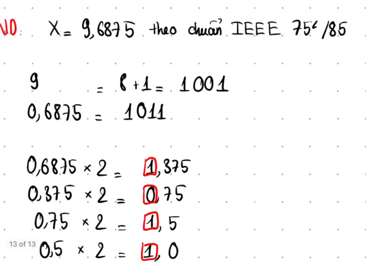

> trích từ : [Tin học đại cương bách khoa hà nội](https://www.youtube.com/watch?v=ITpspAmKpCk&pp=ygUkc-G7kSB04buxYyBk4bqldSBwaOG6qXkgxJHhu5luZyBJRWVl)

**như thế các bit theo thứ tự ta sẽ thu được :** $$\large0.81\approx0.11001..$$ suy ra nó là biểu diễn phần thập phân dưới dạng nhị phân, vậy ta có $$\large11101.11001_{2}$$.

> [!NOTE]
> **Lưu ý:** Quá trình nhân với 2 chỉ dừng khi phần dư bằng 0. Nếu phần dư cứ lặp lại và không bao giờ bằng 0 thì số đó có biểu diễn nhị phân vô hạn. Khi lưu vào IEEE 754, phần cứng sẽ cắt bớt các bit vượt quá số bit fraction cho phép và áp dụng quy tắc làm tròn (rounding) có ở chương [3.Rounding tổng quan và các chế độ làm tròn](#4rounding-tổng-quan-và-các-chế-độ-làm-tròn)

#### 2.1.3.Chuẩn hóa số thực

Tiếp theo là phần chuẩn hóa, phần này chúng ta đã biết tại chương [1.1.Chuẩn hóa số thực (normalized)](#11Chuẩn-hóa-số-thực-normalized) bây giờ chúng ta có $$\large11101.11001_{2}$$ và ta thực hiện di chuyển dấu chấm sang bên trái :

$$
\large11101.11001_{2} \xrightarrow{\text{dịch trái 4bit}} 1.110111001_{2}
$$

nó thành $$\large\boxed{1.110111001_{2}}$$ và ta nhớ ta dịch dấu chấm sang trái 4 lần, vì vậy ta có `actual exponent = 4` đây là mũ số thực (chưa cộng bias).

> [!IMPORTANT]
> Actual Exponent không phải là trường Exponent lưu trong IEEE 754. Đây chỉ là số mũ toán học sau khi chuẩn hóa. Trường Exponent trong IEEE sẽ được tính ở bước tiếp theo bằng công thức `exponent field = actual expnent + bias`

#### 2.1.4.Tính Exponent Field

Ta có `actual exponent = 4` từ phần thực hiện chuẩn hóa số thực, bây giờ chương này ta tính exponent field (trường số mũ), phần này ta dùng `actual expnent + bias`, khái niệm bias có tại chương [1.8.1.Độ lệch (Bias)](#181độ-lệch-bias) cũng ở chương đó ta có một bảng có 3 trường được phân bổ nhị phân do đó mỗi trường đều có toán hạng riêng cho nó, ở đây ta dùng hệ 32bit (float) vậy bias có giá trị là `127`

> [!NOTE]
> **Lưu ý:** giá trị `127` ở phần bias là kết quả của phép tính Tmax $$\large2^{N-1}-1$$, ở đây thực chất bias chỉ có toán hạng là 8bit thôi 

khi biết giá trị của bias ta tiến hành thực hiện tính trường số mũ (Exponent field) = $$\large4 + 127 = \boxed{131_{10}}$$ vậy suy ra trường số mũ có giá trị là `131`

#### 2.1.5.Lấy Fraction

IEEE754 quy định là phần này chỉ được lấy những bit sau dấu chấm, ko được lấy các bit trước dấu chấm vậy ta có $$\large1.110111001_{2}\times2^{4}$$ thì ta lấy fraction `110111001` nhưng theo kiến trúc 32bit (32bit architecture) và dựa vào bảng ở chương bias ta thấy fraction có toán hạng là 23bit vậy ta thêm đơn vị `0` phía sau sao cho đủ 23bit, suy ra fraction là `11011100100000000000000` (đủ 23bit)

> [!NOTE]
> Nếu trường hợp gắp số bit fraction nhiều hơn giới hạn toán hạn của fraction thì CPU sẽ thực hiện cắt bit và làm tròn (rounding), ví dụ fraction có toán hạng là 23bit nhưng đầu vào ở fraction là hơn 23bit thì CPU sẽ cắt sao cho đủ 23bit và rounding

#### 2.1.6.Ghép Sign | Exponent | Fraction

Phần này chỉ ghép lại thôi, bây giờ ta có sign = $$\large0_{2}$$ vì `29.81` là số dương, exponent field = $$\large131_{10} = 10000011_{2}\text{Chuẩn 8bit thỏa mãn trường số mũ}$$, Fraction field = $$\large11011100100000000000000_{2}\text{padding 0 cho đủ 23bit thảo mãn trường phần trị}$$ :

| sign | Exponent | fraction |
|------|----------|----------|
| 0 | 10000011 | 11011100100000000000000 |

**từ trên bảng ta có :** `0 10000011 11011100100000000000000`, bỏ dấu cách đi ta có `01000001111011100100000000000000`, suy ra $$\large29.81_{10} = \boxed{01000001111011100100000000000000_{2}}$$

#### 2.2.Decode

Chương này nói về chuyển đổi số thực biểu diễn dưới dạng nhị phân sang số thực biểu diễn dưới dạng bình thường

#### 2.2.1.Tách Sign | Exponent | Fraction

đây là việc tách một đoạn binary biểu diễn số thực theo 3 trường (sign, exponent và fraction). Ta có `01000001111011100100000000000000`, tách chúng thành `0(sign) 10000011(exponent) 11011100100000000000000(fraction)`

#### 2.2.2.Khôi phục Actual Exponent

chúng ta đã tách được Sign | Exponent | Fraction, nhưng phần số mũ vẫn chưa phải số mũ thật bây giờ ta tính số mũ thật bằng cách lấy Exponent Field có giá trị nhị phân `10000011` bây giờ ta cần phải chuyển nhị phân này sang số nguyên $$\large10000011_{2} = 131_{10}$$ bây giờ ta lấy `131` là số nguyên vừa covert từ binary sang đem đi trừ với bias ta có Actual exponent = $$\large131 - 127 = \boxed{4_{10}}$$ (Đây chính là số mũ toán học thu được ở bước chuẩn hóa. Nó đúng bằng số lần dịch dấu chấm sang bên trái khi chuẩn hóa số thực) cũng chính là số mũ sẽ dùng ở bước cuối khi khôi phục giá trị số thực.

#### 2.2.3.Khôi phục Hidden Bit

Sau khi đã tính được Actual Exponent, bước tiếp theo là khôi phục Hidden Bit (hay còn gọi là Implicit Leading Bit). IEEE quy định rằng đối với số chuẩn hóa (normalized) bit `1` đứng trước dấu chấm sẽ ko được lưu trong bộ nhớ bởi vì sau khi chuẩn hóa nó sẽ có dạng $$\large1.xxx..._{2}\times2^{N}$$ do bit đứng trước dấu chấm bằng 1, IEEE ko cần lưu để tiết kiệm một bit fraction. Vì vậy, khi giải mã (Decode), CPU sẽ tự động thêm lại bit này. ở bước tách sign, exponent, fraction ta đã tách được như sau :

| sign | exponent | fraction |
|------|----------|----------|
| 0 | 10000011 | 11011100100000000000000 |

Và ta đã tính được `Actual exponent = 4` đồng thời nhận thấy $$\large\text{Exponent}\neq00000000$$ và $$\large\text{Exponent}\neq11111111$$ , nên đây là normalized number, CPU sẽ tự động thêm `hiddenbit = 1`. Vậy ta có fraction ban đầu là `11011100100000000000000` nhưng sau khi khôi phục hiddenbit ta có `1.11011100100000000000000` vậy suy ra kết quả là $$\large\boxed{1.11011100100000000000000_{2}}$$

> [!NOTE]
> Hidden Bit không tồn tại trong bộ nhớ. Nó chỉ được CPU tự động thêm vào trong quá trình Decode nếu số thuộc dạng Normalized. Đối với Denormalized Number (Exponent = 00000000), Hidden Bit không còn bằng 1 nữa mà bằng 0. Điều này đã được trình bày ở chương [1.2.Khử chuẩn hóa số thực (Denormalized)](#12khử-chuẩn-hóa-số-thực-denormalized)

**Trường hợp nếu actual exponent lớn hơn toán hạng trường fraction để dịch dấu chấm thì sao?**

Cho actual exponent = 127, trong khi toán hạng của trường fraction ở ngành kiến trúc 32bit chỉ là 23bit thôi, vậy con số `127 > 23` nên chúng ta dịch dấu chấm như thế nào. Chúng ta sẽ dịch dấu chấm bằng cách thêm các padding 0 cho những phần cần thiếu, nghĩa là chúng ta cứ việc dịch dấu chấm ở fraction trước đến khi dấu chấm vượt quá toán hạng của trường fraction khi đó chúng ta mới thêm dấu chấm sao cho dịch đủ 127 ô theo giá trị của actual exponent là được. **Ví dụ** cho toán hạng fraction là 3 và actual exponent là 9, ta có `1.101` bây giờ ta dịch dấu chấm ở fraction sang bên phải 9 ô dịch trước 2 ô là `110.1` bây giờ ta thấy nó gần sắp vượt quá toán hạng của trường fraction. Bây giờ ta tiến hành thêm padding 0 vào và dịch sao cho đủ 9 ô, ta có `1101000000.0` vậy là đủ 9 ô thỏa mãn actual exponent

#### 2.2.4.Nhân với 2^Exponent

Đây ko phải nhân như toán học thông thường mà chỉ là phép dịch dấu chấm ngược chiều lại, **ví dụ** khi encode việc chuẩn hóa dịch dấu chấm sang bên trái là số mũ actual exponent là dương còn sang bên phải nó là âm, thì bây giờ trong decode chúng ta có actual exponent đã giải ở phần [2.2.2.Khôi phục Actual Exponent](#222khôi-phục-actual-exponent), ta có `actual exponent = 4` vậy bây giờ encode mình dịch dấu chấm sang trái 4 lần là actual exponent là 4 thì bây giờ decode mình dịch dấu chấm sang phải như đang trả lại chỗ cũ thôi. Bây giờ ta có `1.11011100100000000000000` là kết quả của phần [2.2.3.Khôi phục Hidden Bit](#223khôi-phục-hidden-bit), ta tiến hành dịch dấu chấm sang phải 4 lần (theo giá trị của actual exponent mà ta đã tính ra ở phần khôi phục exponent) ta có :

$$
\large1.11011100100000000000000_{2} \xrightarrow{\text{dịch phải 4}} 11101.1100100000000000000_{2}
$$ 

vậy kết quả là $$\large\boxed{11101.1100100000000000000_{2}}$$ đây chính là số nhị phân ban đầu trước khi chuẩn hóa

#### 2.2.5.Áp dụng Sign

Đây là bước cuối cùng trong quá trình Decode. Sau khi đã khôi phục lại số nhị phân ban đầu, CPU chỉ cần dựa vào trường Sign để xác định kết quả là số dương hay số âm. Ta có **formula =**$$\large1.xxxxx\times2^{N}$$ **ví dụ** $$\large12345_{10}$$ = $$\large1.2345_{10}\times10^{4}$$, ở các bước trước ta đã khôi phục được `Sign = 0, Actual exponent = 4, Significand = 1.11011100100000000000000` và sau khi thực hiện nhân với $$\large2^{\text{Actual Exponent}}$$ ta có `11101.1100100000000000000`, vì `sign = 0` nên $$\large(-1)^{0} = 1$$ do đó giá trị vẫn giữ nguyên `11101.1100100000000000000`, bây giờ ta chỉ cần chuyển phần nguyên sang thập phân và tính toán fraction (phần dãy bit sau dấu chấm)

Đầu tiên ta có `11101.1100100000000000000` và ta cần chuyển phần nguyên sang thập phân $$\large11101_{2} = 29_{10}$$, bây giờ ta tiến hành tính toán phần fraction sau dấu chấm cách tính là ta lấy số bit nhân với trọng số lũy thừa số nguyên âm **ví dụ** $$\large1\times2^{-1} + 1\times2^{-2} + 0\times2^{-3} +....+ 0\times2^{-N}$$, ở đây ta thấy giá trị bit `0` luôn ra kết quả là `0` vì thế khi tính tổng nó ko thay đổi gì, vậy ta chỉ cần đếm lũy thừa giảm dần và tính toán những bit `1` thôi (trong phần tính toán này phải dùng toán học, ko phải nhị phân nên các bit khi tính toán kiểu này là nó có hệ cơ số 10 vì sẽ ra giá trị là hệ thập phân) :

| bit | trọng số | giá trị |
|-----|----------|---------|
| 1 | $$\large2^{-1}$$ | 0.5 |
| 1 | $$\large2^{-2}$$ | 0.25 |
| 1 | $$\large2^{-5}$$ | 0.03125 |

ta tiến hành tính tổng giá trị lại $$\large0.5 + 0.25 + 0.03125 = 0.78125_{10}$$ bây giờ ghép lại ta có kết quả $$\large\boxed{29.78125_{10}}$$ . Chúng ta vẫn có thể ráp vào công thức như ở phần [1.Tổng quan về IEEE 754](#1Tổng-quan-về-ieee-754) là $$\large(-1)^{S} \times 1.m \times 2^{e-b}$$ ta có $$\large(-1)^{0} \times (1.861328125) \times 2^{4}$$ và vẫn ra kết quả khớp là $$\large29.78125_{10}$$. Giá trị `1.861328125` trong biểu thức là phần trị `Significand = 1.11011100100000000000000` cái phần được tách ở trường fraction lúc đầu, chúng ta quy đổi cả phần này về hệ cơ số 10 bằng cách nhân với trọng số âm như trên bảng vừa rồi

> [!IMPORTANT]
> Ta thấy nó bị chênh lệch số thực, số lúc đầu là `29.81` nhưng sau khi encode và decode ra kết quả lại là `29.78125`. Lý do là vì quá trình chuyển phần thập phân bị cắt sớm và làm tròn theo giới hạn 23 bit fraction hay giới hạn bit fraction theo toán hạng của IEEE 754 single precision

#### 2.3.Số thực lớn nhất và tính toán số thực lớn nhất (Largest finite)

hay còn gọi là số thực hữu hạn lớn nhất, đối với float 32 bit chúng thường có dạng :

| sign | exponent | fraction |
|------|----------|----------|
| 0 | 11111110 | 11111111111111111111111 |

**Lưu ý:** đối với exponent field để biểu diễn số thực lớn nhất tuyệt đối ko đươc là `11111111` vì tất cả bit số 1 này được dùng riêng trong việc biểu diễn infinity và NaN. Như thế đối với 32bit ta có chuỗi bit của số thực hữu hạn lớn nhất như sau `01111111011111111111111111111111` việc decode ra sang số thực hệ cơ số 10 thì chúng ta làm tương tự như [2.2.Decode](#22decode) bây giờ chúng ta tiến hành tính toán số thực lớn nhất của ngành kiến trúc 32bit (float)

đầu tiên như trong chương decode, ta tách các bit ra ở đây chúng ta đã có và tách bit ở bảng trên rồi. Tiếp theo ta tính actual exponent bằng cách chuyển chuỗi nhị phân ở trường exponent sang hệ cơ số 10 $$\large11111110_{2} = 254_{10}$$ bây giờ ta lấy nó đi trừ với bias $$\large254 - 127 = 127$$ vậy actual exponent = $$\large\boxed{127}$$, tiếp theo chúng ta tiến hành tính toán phần trị, đầu tiên là khôi phục hiddenbit ta dịch dấu chấm theo actual exponent nhưng ta thấy nó lớn hơn toán hạng được có ở phần fraction nên chúng ta sẽ thêm padding là 0 để thỏa mãn actual exponent ta có $$\large11111111111111111111111100000000000000000000000000000000000000000000000000000000000000000000000000000000000000000000000000000000.0_{2}$$ tuy hơi dài nhưng nó đã thỏa mãn actual exponent do đây là số chuẩn hóa nên bit ẩn sẽ thêm 1 là bit ở phần có trọng số cao nhất. Bây giờ chúng ta tiến hành tính toán phần fraction với phép mũ âm ta có:

| bit | trọng số | gía trị |
|-----|----------|---------|
| 1 | $$\large2^{-1}$$ | 0.5 |
| 1 | $$\large2^{-2}$$ | 0.25 |
| .. | .. | .. |

như thế tính lần lượt cho hết bit 1 trong trường fraction. Dựa vào công thức có ở [1.Tổng quan về IEEE 754](#1Tổng-quan-về-ieee-754) là $$\large(-1)^{S} \times 1.m \times 2^{e-b}$$, ta tiến hành ráp vào bây giờ sign = 0, actual exponent = 127, bias = 127, tổng cấp số nhân gía trị fraction là $$\large2-2^{-23}$$ khi ráp ta được $$\large(-1)^{0} \times (2-2^{-23}) \times 2^{127}$$ bây giờ ta lấy casio tính cái biểu thức này ra ta được $$\large\boxed{340282346638528859811704183484516925440}$$ đây chính là giá trị chính xác của số thực hữu hạn lớn nhất 32bit float

lý do giá trị phần trị lại là $$\large2-2^{-23}$$ vì đó chỉ là phần rút gọn theo cấp số nhân của phần trị số thực thôi, điều này thường sẽ nói rất rõ bên phía toán học

#### 2.4.Số thực chuẩn hóa nhỏ nhất và tính toán số thực chuẩn hóa nhỏ nhất (Smallest normalized)

Số thực chuẩn hóa nhỏ nhất (Smallest Normalized) là số thực dương nhỏ nhất vẫn còn thuộc miền Normalized, nghĩa là trường Exponent không bằng toàn bit 0. **Ví dụ** với `float` có `exponent = 8, fraction = 23, bias = 127` bây giờ số thực chuẩn hóa nhỏ nhất của `float` là :

| sign | exponent | fraction |
|------|----------|----------|
| 0 | 00000001 | 000000000000000000000000 |

do `exponent field = 1` nên ta có `actual exponent = 1 - 127 = -126` đồng thời fraction toàn bit 0 nên phần trị (significand) là `1.0` vậy ta có $$\large1.0_{2}\times2^{-126}$$ vậy kết quả là $$\large\boxed{1.17549435082\times10^{-38}}$$

> [!NOTE]
> một mẹo nhỏ là khi muốn biết nhanh số thực chuẩn hóa nhỏ nhất ta chỉ cần tính $$\large2^{1-bias}$$ và lấy casio bấm sẽ ra kết quả

> [!IMPORTANT]
> đối với số thực chuẩn hóa nhỏ nhất, trường sign và trường fraction luôn là `0`. Chỉ có trường exponent luôn có giá trị là `1` đối với số chuẩn hóa nhỏ nhất như trên bảng, nếu thay đổi một trong ba trường thì sẽ ko phải là số nhỏ nhất nữa

#### 2.5.Số thực khử chuẩn hóa nhỏ nhất và tính toán số thực khử chuẩn hóa nhỏ nhất (Smallest subnormal)

Số thực khử chuẩn hóa nhỏ nhất (Smallest subnormal) là số thực dương nhỏ nhất mà IEEE 754 còn biểu diễn được trước khi giá trị trở thành 0. Đây là giá trị nhỏ nhất trong toàn bộ tập số thực IEEE 754 (không tính số 0).

Đối với số khử chuẩn hóa, trường exponent luôn bằng toàn bit 0 và Hidden Bit không còn bằng 1 mà bằng 0. Để tạo ra giá trị nhỏ nhất khác 0 thì trường fraction chỉ được phép có đúng một bit 1 ở vị trí cuối cùng. **Ví dụ** với kiểu `float` ta có :

| sign | exponent | fraction                |
| ---- | -------- | ----------------------- |
| 0    | 00000000 | 00000000000000000000001 |

> để ý là với số thực khử chuẩn hóa nhỏ nhất luôn có LSB trường fraction là bit 1

do `exponent field = 0` nên `hidden bit = 0` (yes sir, vì vốn dĩ khử chuẩn hóa đã hidden bit là 0 rồi nó được đề cập tại chương [1.2.Khử chuẩn hóa số thực (Denormalized)](#12khử-chuẩn-hóa-số-thực-denormalized)) và `actual exponent = 1 - 127 = -126` (vì khử chuẩn hóa là $$\large2^{1 - bias}$$) thì ta có phần trị (significand) là $$\large0.00000000000000000000001_{2}$$ do đó $$\large2^{-23}\times2^{-126} = \boxed{2^{-149}}$$

> giá trị `-23` là bao quát hết fraction của `float` còn nếu muốn lý do vì sao nó lại là số âm thì mở phần details

<details>
	<summary>vì sao lại là -23 (lại là số âm)?</summary>

Ko có gì cao siêu, chỉ là phép tính decode bit fraction ở chương [2.2.5.Áp dụng Sign](#225áp-dụng-sign) . Ở đây, lý dó `-23` là số âm vì do dịch vị trí của bit. Cho bảng sau :

| Vị trí     | Giá trị   |
| ---------- | --------- |
| bit thứ 1  | $$\large2^{-1}$$  |
| bit thứ 2  | $$\large2^{-2}$$  |
| bit thứ 3  | $$\large2^{-3}$$  |
| ...        | ...       |
| bit thứ 23 | $$\large2^{-23}$$ |

Bit 1 duy nhất nằm ở vị trí thứ 23 sau dấu chấm, nên giá trị của significand là $$\large2^{-23}$$

</details>

Vậy số thực khử chuẩn hóa nhỏ nhất của float là $$\large2^{-149} = \boxed{1.40129846432\times10^{-45}}$$

> [!NOTE]
> Một mẹo nhỏ là với float, số thực khử chuẩn hóa nhỏ nhất luôn bằng $$\large2^{-149}$$ hoặc cũng có thể tính bằng $$\large2^{1-\text{bias}-\text{fraction bit}}$$ thì với float $$\large2^{1-127-23} = 2^{-149}$$ hoặc dùng phép nhân như vừa rồi

> [!IMPORTANT]
> Đối với số thực khử chuẩn hóa nhỏ nhất:
> - Sign = 0
> - Exponent = toàn bit 0
> - Fraction chỉ có đúng bit cuối cùng bằng 1.
>
> Nếu Fraction cũng bằng toàn bit 0 thì giá trị không còn là số thực nhỏ nhất nữa mà chính là **+0**.

> trả lời câu hỏi tại phần details

<details>
	<summary>vậy phép tính actual exponent = 1 - 127 = -126 là tính 1 - bias à, này là của khử chuẩn hóa mà sao trước đó tại chương chuẩn hóa lại sử dụng và chương này cũng sử dụng chung phép tính này?</summary>

Nhìn cách tính thì cũng giống nhưng lý do của hai cái hoàn khác. Đầu tiên là chuẩn hóa (normalized) nếu Fraction $$\large\neq$$ 00000 và Fraction $$\large\neq$$ 11111 thì `actual exponent = E - bias` điều này cũng khá đúng và đã được nêu ở phần tổng quan với formula rồi, ví dụ trên là `exponent = 1, bias = 127` thì nó tính actual `exponent = 1 - 127 = -126` là hoàn toàn bình thường

nhưng vẫn là một phép tính mà khử chuẩn hóa (denormalized) vẫn sử dụng chính phép tính đó, vì denormalized có hiddenbit là 0 , IEEE ko đi dùng `actual exponent = 0 - bias` thay vào đó nó vẫn là `exponent = 1 - 127 = -126` dù hiddenbit là 0. Nghe có vẻ giống normalized, nhưng lý do hoàn toàn khác.

**Tại sao lại dùng 1 − Bias?**

Mục đích là để miền subnormal nối liên tục với miền normalized. **Ví dụ** với kiểu `float`  giả sử Smallest normalized ta có `exponent = 00000001, fraction = 000...` và giá trị của nó là $$\large1.0_{2}\times2^{-126}$$ và actual exponent là kết quả của phép tính `e - bias` trên. Còn đối với subnormal ta có `exponent = 00000000, fraction = 111...` và giá trị của nó là $$\large0.11111_{2} \times 2^{-126}$$ do với khử chuẩn hóa hiddenbit là 0 và nó chỉ nhỏ hơn một chút so với $$\large1.00000_{2} \times 2^{-126}$$ ta thấy hai miền nối sát nhau

Nếu IEEE dùng `actual exponent = 0 - 127 = -127` đối với khử chuẩn hóa thì số lớn nhất sẽ là $$\large0.11111_{2} \times 2^{-127}$$ nó nhỏ hơn đúng một nữa .Lúc đó sẽ xuất hiện một khoảng trống lớn giữa normalized và subnormal. IEEE 754 được thiết kế để không có khoảng trống này

| Loại số    | Điều kiện           | Actual exponent |
| ---------- | ------------------- | --------------- |
| Normalized | `Exponent = 1..254` | `E - Bias`      |
| Subnormal  | `Exponent = 0`      | `1 - Bias`      |

**Quan trọng :**

 - `1 - 127 = -126` xuất hiện ở normalized nhỏ nhất vì `E = 1`.

 - `1 - 127 = -126` cũng xuất hiện ở mọi subnormal vì chuẩn IEEE quy định cố định như vậy.

**Hai phép tính cho ra cùng kết quả -126, nhưng nguồn gốc khác nhau:**
 - Normalized: do áp dụng công thức E - Bias với E = 1.

 - Subnormal: do IEEE định nghĩa đặc biệt là 1 - Bias, không lấy E = 0 - Bias

</details>

#### 2.6.Số thực lớn nhất trong miền khử chuẩn hóa (Largest subnormal)

---

## 3.Rounding tổng quan và các chế độ làm tròn

- không phải mọi số thập phân đều biểu diễn chính xác trong nhị phân, nên IEEE 754 phải làm tròn (rounding). Đây là nguyên nhân của những kết quả như `0.1 + 0.2 != 0.3` trong nhiều ngôn ngữ lập trình. Phần chương này sẽ biểu diễn và tổng quát về việc này

**Vì sao lại phải rounding?:** Trong hệ thống máy tính, bit nhị phân là hữu hạn nhưng biểu diễn số thực một cách chính xác lại phải vô hạn nên khi đến một ngưỡng nào đó đụng tới rào cản hữu hạn sẽ xem như làm tròn của bit nhị phân đó ví dụ 4 bit $$\large0000_{2}$$ thì số thực chỉ được biểu diễn ở phạm vi bit này, bit được cấp cho trường fraction và các trường khác lại rất ít nên độ chính xác vì thế mà giảm rất đáng kể

<details>
	<summary>Ví dụ C</summary>

Cho đoạn C như sau :

```c
#include <stdio.h>
#include <stdint.h>
#include <string.h>

int main(void)
{
    float x = 0.1f + 0.2f;

    uint32_t bits;
    memcpy(&bits, &x, sizeof(bits));

    printf("value = %.20f\n", x);
    printf("bits  = 0x%08X\n", bits);
}
```

> gcc -o float_rounding float_rounding.c

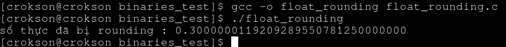

ta thấy số thực nó đã bị làm tròn ở đây khá hỗn loạn nên cũng là lý do x($$\large0.1_{10} + 0.2_{10}$$) $$\large\neq$$ 0.3, chỉ có thể biểu diễn **xấp xỉ** với trường hợp này chứ ko thể dùng **tuyệt đối** như `==`

</details>

Các chế độ của Rounding (làm tròn)

#### 3.1.biểu diễn nhị phân hữu hạn và biểu diễn nhị phân vô hạn

Đây là chương sẽ lý giải tại sao cùng một phép cộng số thực nhưng `1.50 + 1.25 = 2.75` và ko có khái niệm rounting nào xảy ra ở phép cộng `1.50`. Tất cả là do biểu diễn nhị phân hữu hạn và biểu diễn nhị phân vô hạn

**Biểu diễn nhị phân hữu hạn:** là việc biểu diễn nhị phân có độ rộng toán hạng được giới hạn ở một ngưỡng nào đó **ví dụ** $$\large1.101_{2}$$ chỉ có 3bit fraction rồi xong hết, còn các fraction nếu dư sẽ luôn có bit là 0. **Ví dụ2:** cho số $$\large1.50_{10}$$ nó cũng là hữu hạn. 

**Bằng chứng nào để chứng minh nó hữu hạn?:** Là khi số hữu hạn luôn thực hiện phép nhân và fraction có giá trị là 0, chúng ta dùng số gốc để nhân 2 và nếu có phần dư thì lấy phần dư nhân tiếp cho 2 **ví dụ** với số thực $$\large1.25_{10}$$ ta xét bit fraction là $$\large0.25_{10}$$ :

| Bước | Giá trị x2  | Bit | Phần dư |
| ---- | ----------- | --- | ------- |
| 1    | 0.25×2=0.50 | 0   | 0.50    |
| 2    | 0.50×2=1.00 | 1   | 0       |

Dừng ở bước 2 do phần dư là 0, ta có $$\large0.25_{10} = 0.01_{2}$$ vì bit ở bước 1 và 2 lần lượt là 0 và 1, nên ta có $$\large1.25_{10} = \boxed{1.01_{2}}$$ . Đây là hữu hạn do phần dư là 0 ở bước hai, ta cho thêm **ví dụ** là $$\large0.75_{10}$$ tính fraction trước y nhưu trên :

| Bước | x2          | Bit | Dư   |
| ---- | ----------- | --- | ---- |
| 1    | 0.75×2=1.50 | 1   | 0.50 |
| 2    | 0.50×2=1.00 | 1   | 0    |

ta cũng dừng ở bước 2, ta có $$\large0.75_{10} = \boxed{0.11_{2}}$$, nó là hữu hạn vì số dư là 0 ở bước 2

<details>
	<summary>Ví dụ với C</summary>

```c
#include <stdio.h>

int main(void){
	float x = 1.50; //binary = 1.10
	printf("dump fration 23bit : %.23f\n",x);
}
```

> gcc -o dump_floating_point_fraction dump_floating_point_fraction.c

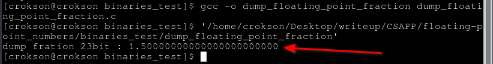

Ta thấy khi gán vào x là 1.50, và ta dump ra nó vẫn đúng số 1.5 nhưng fraction phía sau này là giá trị 0 hết. Chúng ta thử thực hiện phép tính cộng vào xem sao

```c
#include <stdio.h>

int main(void){
	float x = 1.50; //binary = 1.10
	float y = 1.25; //binary = 1.01
	printf("dump fration 23bit : %.23f\n",x + y); //phần này sẽ biểu diễn số hữu hạn
}
```

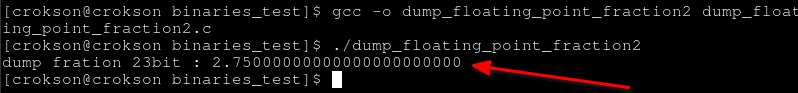

Ta thấy nó vẫn là kết quả chính xấc, ko có rounting nào ở đây vì nó là số hữu hạn.

</details>

**Biểu diễn nhị phân vô hạn:** là việc biểu diễn nhị phân có độ rộng toán hạng ko được giới hạn tới khi bị cắt bởi phần cứng do giới hạn độ rộng toán hạng bên phía phần cứng **ví dụ** $$\large0.1_{2}$$ tính fraction nó với 2:

| Bước | x2      | Bit | Dư  |
| ---- | ------- | --- | --- |
| 1    | 0.1->0.2 | 0   | 0.2 |
| 2    | 0.2->0.4 | 0   | 0.4 |
| 3    | 0.4->0.8 | 0   | 0.8 |
| 4    | 0.8->1.6 | 1   | 0.6 |
| 5    | 0.6->1.2 | 1   | 0.2 |
| 6    | 0.2->0.4 | 0   | 0.4 |
| 7    | 0.4->0.8 | 0   | 0.8 |
| 8    | 0.8->1.6 | 1   | 0.6 |

Ta thấy nó cứ lặp lại từ `0.2 -> 0.6` giống kim đồng hồ và số dư ko có điểm dừng. Đây gọi là biểu diễn nhị phân vô hạn, và đây cũng là điều kiện để hệ thống rounting (làm tròn) dãy này

<details>
	<summary>Ví dụ với C</summary>

```c
#include <stdio.h>

int main(void){
	float x = 0.1;
	printf("dump fration 23bit : %.23f\n",x);
}
```

> gcc -o dump_floating_point_fraction3 dump_floating_point_fraction3.c

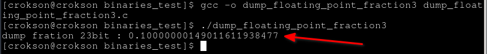

Ta thấy khi gán vào x là 0.1, và ta dump ra nó đã bị rounting ở fraction phía sau do đây là biểu diễn nhị phân vô hạn. Chúng ta thử thực hiện phép tính cộng vào xem sao

```c
#include <stdio.h>

int main(void){
	float x = 0.1;
	float y = 0.2;
	printf("dump fration 23bit : %.23f\n",x + y); //xấp xỉ 0.3 chứ ko phải tuyệt đối do rounting
}
```

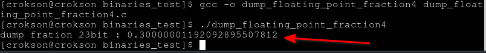

Ta thấy nó vẫn bị rounding

</details>

**Định lý đẹp của biểu diễn vô hạn và hữu hạn:** một phân số tối giản $$\large\frac{a}{b}$$ sẽ có biểu diễn hữu hạn trong cơ số 2 khi và chỉ khi mẫu số b chỉ chứa thừa số nguyên tố 2. **Ví dụ** $$\large0.5_{10} = \frac{1}{2}$$ ta có mẫu là 2 suy ra nó hữu hạn, $$\large0.25_{10} = \frac{1}{4}$$ mẫu là $$\large2^{2}$$ suy ra nó hữu hạn, $$\large0.75_{10} = \frac{3}{4}$$ mẫu là $$\large2^{2}$$ suy ra nó hữu hạn. Nhưng còn, $$\large0.1_{10} = \frac{1}{10} = \frac{1}{2\times5}$$ mẫu có 5 và nó ko thể viết hữu hạn trong cơ số 2, suy ra nó vô hạn

> [!IMPORTANT]
> **Điều quan trọng:** Không phải mọi phép cộng, trừ, nhân hay chia số thực đều sinh ra sai số làm tròn. Nếu các toán hạng và kết quả đều biểu diễn chính xác được trong IEEE 754 thì sẽ không phát sinh sai số tại bước biểu diễn hay bước làm tròn. **Ví dụ** `1.50 + 1.25 = 2.75` được biểu diễn chính xác nên kết quả vẫn đúng tuyệt đối.
>
> Ngược lại, nếu một số không thể biểu diễn chính xác trong IEEE 754 (chẳng hạn `0.1`, `0.2` có biểu diễn nhị phân vô hạn) thì ngay từ khi lưu vào bộ nhớ chúng đã phải làm tròn. Sau đó các phép toán tiếp theo sẽ làm việc trên các giá trị đã được làm tròn này, nên kết quả có thể tiếp tục xuất hiện sai số. Ví dụ `0.1 + 0.2` không cho đúng chính xác `0.3`.

#### 3.2.Round to nearest, ties to even

- Đây là chế độ mặc định của việc làm tròn số thực dấu phẩy động của IEEE , nó thực hiện làm tròn về số gần nhất, nếu đúng giữa hai số thì chọn số chẵn. Ý tưởng gồm hai bước, đầu tiên là nó chọn giá trị gần nhất với số cần biểu diễn, thứ hai là phân theo ba trường hợp, trường hợp số nhỏ hơn nữa sẽ giữ nguyên, trường hợp số lớn hơn nữa sẽ làm tròn lên, trường hợp số đúng bằng nữa (tie) thì chọn số bit cuối là 0 (even)

**Đầu tiên :** làm tròn về số gần nhất, **ví dụ** `0.3244` làm tròn thành `0.324`, `0.3246` làm tròn thành `0.325` đơn giản là làm tròn về số gần nhât

**Thứ hai :** như trên sẽ phân theo ba trường hợp 

nếu trường hợp số nhỏ hơn nữa sẽ giữ nguyên **ví dụ** Cpu chỉ giữ 2 fraction ở bit, cho bit biểu diễn số thực như sau : $$\large1.010001_{2} = \mathbf{1.265625_{10}}$$ và bây giờ CPU lấy 2 fraction suy ra nó chỉ có thể biểu diễn làm tròn $$\large1.01_{2} = 0100_{2}$$ hoặc $$\large1.10_{2} = 1000_{2}$$ và bit bị cắt là $$\large0001_{2}$$

- **Lưu ý :** giá trị $$\large1.10_{2} = 1000_{2}$$ và $$\large1.01_{2} = 0100_{2}$$ ở đây ta thấy có phần nguyên là bit 1, nhưng việc quy đổi và so sánh ở trường hợp này là chỉ tính các bit fraction chứ ko phải phần nguyên

bây giờ so sánh **phần bị cắt với đúng một ngưỡng là một nữa của ULP**:

> Phần details về ULP

<details>
	<summary>ULP(unit in the last place)</summary>

Đây là khái niệm dùng để giải thích vì sao CPU làm tròn bằng cách này, ko phải cấu trúc chính của IEEE. Về nghĩa đen là giá trị của 1 đơn vị ở bit cuối cùng ở fraction, đơn giản hơn nó là khoảng cách giữa hai số IEEE 754 có thể biểu diễn được **ví dụ** sau chuẩn hóa ta có tập hợp $$\large(1.00_{2},1.01_{2},1.10_{2},1.11_{2})$$ và các số này lần lượt tương ứng với tập hợp $$\large(1.00_{10},1.25_{10},1.50_{10},1.75_{10})$$ và bây giờ khoảng cách giữa chúng là :

| phép tính | kết quả |
|-----------|---------|
| 1.25 - 1.00 | 0.25 |
| 1.50 - 1.25 | 0.25 |
| 1.75 - 1.50 | 0.25 |

Vậy ULP = 0.25, nếu gặp trường hợp như `một nữa của ULP` thì lấy đó chia hai lên thôi, ví dụ $$\large\frac{0.25}{2} = 0.125$$ thì con số `0.125` này chính là con số ở ngưỡng mà IEEE quyết định làm tròn 

</details>

Ở đây ta tiến hành tính ULP trước tiên phải biết $$\large1.01 = \mathbf{1.25_{10}}$$ và $$\large1.10 = \mathbf{1.50_{10}}$$ :

| phép tính | kết quả |
|-----------|---------|
| 1.50 - 1.25 | 0.25 |

$\large\mathrm{ULP} = \boxed{0.25}$ vậy bây giờ ta biết $$\large0.25_{10} = \mathbf{0.01_{2}}$$ bây giờ ta lấy nó chia cho hai vì half ULP mà $$\large\frac{0.25}{2} = \mathbf{0.125_{10}}$$ bây giờ ta biết $$\large0.125_{10} = 0.001_{2}$$ bây giờ viết đầy đủ 4bit ta có $$\large0.0010_{2}$$ và nó chính là ngưỡng làm tròn, tiến hành so sánh phần bị cắt với half ULP $$\large0001_{2} < 0010_{2}$$ ta thấy nó nhỏ hơn vậy nó sẽ giữ nguyên $$\large\boxed{1.01_{2}}$$

<details>
	<summary>Vì sao lại đem phần bị cắt đi so với half ULP?</summary> 

- **Vì sao lại đem phần bit bị cắt đi so với half ULP:** Vì phần bị cắt chính là phần sai số (error) nếu giữ nguyên số hiện tại, IEEE cần biết lượng sai số này xem nó lớn hay nhỏ hơn với nữa khoảng cách giữa hai số biểu diễn được (half ULP) để quyết định giữ nguyên hay làm tròn lên, Bây giờ **giả sử** CPU chỉ giữ lại một số lượng bit fraction nhất định. Khi cắt bớt bit, phần bị cắt là phần sai số (lượng giá trị bị mất), sau khi đã xác định hai giá trị IEEE có thể biểu diễn gần nhất, IEEE chỉ cần xét phần giá trị bị mất (phần bị cắt) để quyết định làm tròn., nó chỉ biết lượng giá trị bị mất này lớn đến đâu, IEEE lấy lượng gía trị bị mất so sánh với một nữa ngưỡng khoảng cách biểu diễn giữa hai số (half ULP), phần bị cắt chính là sai số khi giữ nguyên, còn half ULP là ngưỡng quyết định. IEEE chỉ cần so sánh hai đại lượng này để biết nên giữ nguyên hay làm tròn lên. Đây cũng là bản chất thuật toán, CPU nó ko so sánh hai số, nó chỉ so sánh số bit bị cắt với half ULP

</details>

nếu trường hợp số lớn hơn nữa sẽ làm tròn, **ví dụ** $$\large1.010011_{2}$$ và như cũ CPU giữ lại 2 fraction là $$\large1.01_{2}$$ và $$\large1.10_{2}$$ và số bit bị cắt là $$\large0011_{2}$$ bây giờ ta tính ULP:

| phép tính | kết quả |
|-----------|---------|
| 1.50 - 1.25 | 0.25 |

vẫn như cũ, $$\large\mathrm{ULP} = \boxed{0.25}$$ và ta biết half ULP của này là $$\large0.125_{10} = 0.001_{2}$$ tròn 4bit là $$\large0.0010_{2}$$ vì đó có sẵn ở ví dụ trước. Bây giờ so sánh phần sai số (round error) và nữa khoảng cách giữa hai số biểu diễn được (half ULP) suy ra $$\large0011_{2} > 0.0010_{2}$$ suy ra nó sẽ làm tròn thành $$\large\boxed{1.10}$$

> Câu hỏi về làm tròn

<details>
	<summary>Nhưng vấn đề mà chúng ta thường hay rối ở đây là nếu có lệnh quyết định làm tròn sau khi so sánh half ULP thì tự hỏi nó làm tròn một đơn vị bit hay làm tròn cả dãy bit theo mô hình toán học?</summary>

- IEEE 754 không làm tròn từng bit bị cắt, cũng không làm tròn cả dãy bit theo kiểu toán học. Nó chỉ thay đổi đúng một đơn vị ở bit fraction cuối cùng được giữ lại (1 ULP của kết quả), rồi để phép cộng nhị phân tự lan carry nếu cần. **Ví dụ** giả sử CPU chỉ lưu 4 fraction `1.0111 100...` trong đó `100...` sau cùng này là số bit bị cắt, sau khi xét GRS (G = 1, R = 0, S = 0) nếu G = 1 rồi thì chắc chắn nó lớn hơn half ULP nên điều này quyết định làm tròn, bây giờ mới tới phần làm tròn CPU nó ko biến `100...` thành `000...` hay xử lý từng bit phía sau nó chỉ thực hiện cộng thêm đúng một bit ở fraction cuối cùng được giữ.

**Ví dụ** $$\large1.0111_{2}$$ CPU giữ 4 fration trong đó là $$\large0111_{2}$$, bit cuối cùng của fraction là `1`, còn bit đầu tiên của fraction là `0`

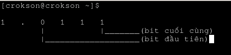

khi làm tròn, CPU chỉ thực hiện cộng một đơn vị bit vào bit cuối cùng của fraction thôi nghĩa là nó chỉ thực hiện:

```
 1.0111 (gốc)
+
 0.0001 (cộng một đơn vị vào bit cuối cùng)
--------
 1.1000 (kết quả làm tròn)
```

đó chính là cách CPU làm tròn bit khi số bit bị cắt lớn hơn half ULP

</details>

nếu trường hợp số bằng đúng bằng nữa (tie) thì chọn số bit cuối là 0 (even) nó sẽ chọn số có LSB là 0, **ví dụ** ta có $$\large0.010010_{2}$$ với CPU chỉ giữ fraction ta có hai dạng như ví dụ trước là $$\large0.01_{2}$$ hay $$\large0.10_{2}$$ ở đây phần bị cắt là $$\large0010_{2}$$ và ta biết `half ULP = 0.125` vì nó vẫn tương tự ở các ví dụ trên thôi. Bây giờ, ta so sánh thấy phần đặc biệt là half ULP bằng với bit bị cắt $$\mathbf{\large0010_{2}\text{(số bit bị cắt)} == 0010_{2}\text{(Half ULP)}}$$ vì $$\large0.125_{10} = 0.001_{2}\text{(half ULP)}$$ tính theo đúng 4bit sẽ là $$\large\mathbf{0010_{2} \text{(half ULP)}}$$ ở đây việc nó bằng nhau thế này ta gọi đó là trường hợp bằng đúng bằng nữa (tie) nghĩa là giá trị phần bị cắt (round error) bằng đúng half ULP, tức sai số khi giữ nguyên và sai số khi làm tròn lên là như nhau. Số cần biểu diễn nằm đúng ở chính giữa hai số IEEE 754 có thể biểu diễn được.

Lúc này, IEEE ko được phép lúc nào cũng làm tròn lên vì nếu vậy thì nó sẽ sinh ra sai số dương tích lũy sau hàng triệu phép tính, thay vào đó nó quy định nếu đúng bằng half ULP thì chọn số có bit cuối cùng (LSB) bằng 0 (even). Ví dụ trường hợp này $$\mathbf{\large0010_{2}\text{(số bit bị cắt)} == 0010_{2}\text{(Half ULP)}}$$ thì đối tượng được làm tròn là $$\large1.10_{2}\text{hay}1.01_{2}$$ ta phân tích hai số này, $$\large1.10_{2}$$ có `LSB = 0` và $$\large1.01_{2}$$ có `LSB = 1` ta thấy IEEE quy định thì nó sẽ chọn số bit cuối cùng (LSB) bằng 0 (even) thì `LSB = 1` sẽ ko được chọn vì nó khác 0, `LSB = 0` sẽ được chọn vì nó bằng 0. Nên, số làm tròn sẽ thành $$\large\boxed{1.10_{2}}$$ vì nó có `LSB = 0` (thỏa mãn quy định của IEEE)

> [!IMPORTANT]
> Round to nearest, ties to even là nghệ thuật làm tròn mặc định mà chuẩn IEEE quy định:
> - nếu `(half ULP) < (số bit bị cắt)`, đây được gọi là số lớn hơn nữa và nó sẽ được làm tròn 
> - nếu `(half ULP) > (số bit bị cắt)`, đây được gọi là số bé hơn nữa và nó sẽ được giữ nguyên
> - nếu `(half ULP) = (số bit bị cắt)`, đây được gọi là số bằng đúng bằng nữa (tie) và nó sẽ chọn LSB có bit là 0 (even)
>
> so sánh một nữa khoảng cách giữa hai số biểu diễn được (half ULP) với bit bị cắt, điều dễ nhầm là chúng ta thường lấy bit bị cắt đi so sánh với bit fraction

#### 3.2.1.guard bit

Guard bit là bit đầu tiên bị cắt bỏ ngay sau bit fraction cuối cùng mà CPU quyết định giữ lại. **Ví dụ** như các ví dụ trên thì CPU giữ 2fraction, ở đây lấy ví dụ với bit $$\large1.0101101_{2}$$ bây giờ fraction là $$\large1.01_{2}$$ còn bit bị cắt là $$\large01101_{2}$$ bây giờ CPU sẽ chia số bit bị cắt này ra 4 phần trong đó có fraction, guard bit (G) , round bit (R) và sticky bit (S), nó sẽ chia như sau :

| Fraction | G | R | S |
|----------|---|---|---|
| 1.01	   | 0 | 1 | 101 |

Ta thấy, `G = 0` suy ra `guard bit = 0`, `R = 1` suy ra `round bit = 1`, `S = 1` suy ra `sticky bit = 1 (vì ít nhất nó cũng có bit 1)`

**Guard bit dùng để làm gì?:** Guard bit là phép kiểm tra đầu tiên. Nếu G = 0 thì chắc chắn nhỏ hơn half ULP. Nếu G = 1 thì chưa thể kết luận đã vượt half ULP hay mới đúng bằng half ULP, nên CPU phải kiểm tra thêm Round bit và Sticky bit. Thay vì tính thủ công là ULP xong chia lấy half ULP xong so sánh round error v..v thì CPU chỉ cần nhìn Guardbit, roundbit, stickybit (GRS). Nhưng ở đây ta chỉ nói riêng về Guardbit, nếu CPU nhìn `guardbit = 0` chắc chắn `x < half ULP` còn nếu `guardbit = 1` thì cần phải soi thêm round và sticky

#### 3.2.2.round bit

Round bit là bit thứ hai bị cắt, nó nằm phía sau Guard bit. Nó có ý nghĩa nếu guardbit là 1, nếu guardbit (G) là 0 thì biết chắc chắn là `x < half ULP` rồi ko cần phải soi round và sticky, nhưng nếu guard là 1 thì bây giờ mới soi round. Ở đây, cũng như ví dụ trên ta có :

| Fraction | G | R | S |
|----------|---|---|---|
| 1.01	   | 0 | 1 | 101 |

Cái này chắc chắn là `x < half ULP` vì `G = 0` nên round sẽ ko có ý nghĩa, nhưng giả sử ta cho `G = 1` như :

| Fraction | G | R | S |
|----------|---|---|---|
| 1.01	   | 1 | 1 | 101 |

thì lúc này `G = 1` nó sẽ soi thêm R vì lúc này round mới thực sự có ý nghĩa, nếu `G = 1 và R = 1` thì nó chắc chắn sẽ lớn hơn half ULP `x > half ULP` lúc này sẽ làm tròn lên

> [!IMPORTANT]
> Nếu `G = 0` thì R và S sẽ ko cần soi nữa, vì nó chỉ có ý nghĩa nếu `G = 1` là trước tiên xong mới tới R và mới tới S.
> - Nếu `G = 1 và R = 1` thì chắc chắn lớn hơn half ULP
> - Nếu `G = 1 và R = 0` thì phải soi thêm Sticky bit

#### 3.2.3.sticky bit

Sticky bit là bit thứ 3, nó đứng ngay sau round bit cái đặc biệt của sticky bit này ko phải là một bit cụ thể bị cắt, mà là kết quả OR với tất cả các bit còn lại phía sau roundbit, nó luôn soi là sau roundbit còn bit nào nữa ko, nếu ko còn bit nào nữa thì `S = 0` còn nếu có thì `S = 1`. Đó là lý do mà sticky bit (S) là bit 0 hoặc bit 1 dù sau nó là hàng chục hay hàng trăm bit. Ví dụ ở trên là ;

| Fraction | G | R | S |
|----------|---|---|---|
| 1.01	   | 1 | 1 | 101 |

Ở đây ta thấy trường sticky bit có chuỗi nhị phân là `101` vậy nên sticky sẽ có bit 1 `S = 1`. Ví dụ khác :

| Fraction | G | R | S |
|----------|---|---|---|
| 1.01	   | 1 | 1 | 000 |

Ở đây ta thấy trường sticky bit có chuỗi nhị phân là `000` vậy nên sticky sẽ có bit 1 `S = 0` (do ko có bit nào là 1). Ví dụ khác :

| Fraction | G | R | S |
|----------|---|---|---|
| 1.01	   | 1 | 1 | 010 |

Ở đây ta thấy trường sticky bit có chuỗi nhị phân là `010` vậy nên sticky sẽ có bit 1 `S = 1` (do có bit giữa là 1). Từ 3 ví dụ, ta thấy hễ một binary strings sau trường roundbit có một bit 1 thì `S = 1` còn nếu ko có bit 1 nào thì `S = 0`

**Sticky bit dùng để làm gì?:** Nó được dùng khi `G = 1, R = 0` lúc này CPU vẫn chưa biết đang đúng half ULP `x == half ULP` hay đã lớn hơn half ULP `x > half ULP` sticky bit sẽ phân biệt hai trường hợp này

#### 3.2.4.cách phần cứng dùng các guard bit, round bit và sticky bit để xác định ba trường hợp

Theo 3 chương về guard bit, round bit, sticky bit (GRS) ta có bảng :

| G | R | S | Kết luận         |
| - | - | - | ---------------- |
| 0 | x | x | < half ULP       |
| 1 | 0 | 0 | = half ULP (tie) |
| 1 | 0 | 1 | > half ULP       |
| 1 | 1 | x | > half ULP       |

các important trên cho thấy, nếu `G = 0` chắc chắn `x < half ULP` nếu `R = 1, G = 1` chắc chắn `x > half ULP`. Nên phần cứng ko thể soi riêng biệt một bit trừ khi bit đó có quy luật khi là 0 thì chắc chắn có giá trị này ví dụ như guard bit. Bảng trên thì đó là cách phần cứng dùng GRS để biết khi nào giữ nguyên, khi nào làm tròn và khi nào lấy LSB = 0.

<details>
	<summary>Vì sao không thể quan sát Guard, Round và Sticky bit trên một biến float?</summary>

**Ý tưởng:** dùng số thực vô hạn để tạo ra hiệu ứng rounding của hệ thống, và tính toán lại để so sánh chế độ làm tròn round to nearest, ties to even xem có đúng như ban đầu không đồng thời truy tìm các bit bị cắt có thể là tầm 5 bit vì 2 bit cho G, R và 3 bit cho S. Ở đây, ta nhắm tới fraction và dùng float 32bit và fraction trong architecture này là 23bit bảng toán hạng được phân cho từng trường có tại chương [1.8.1.Độ lệch (Bias)](#181độ-lệch-bias)

```c
#include <stdio.h>
#include <stdint.h>
#include <string.h>

int main(void){
	float a = 0.1f; //số thực vô hạn
	int o,z;
	uint32_t raw;

	memcpy(&raw, &a, 4);

	printf(" infinity floating point numbers: %.23f\n raw: %08x\n binary: ",a,raw);

	for(int i = 0; i < 35; i++){ //cố tình để 35 in quá fraction
		o = (int)a; //ép kiểu để lấy phần nguyên, kết quả đầu tiên là 0
		printf("%d",o);
		a -= o; //lấy phần thập phân ví dụ 1 + 1.23 = 0.23
		a *= 2; //theo quy định encode thì phần thập phân nhân 2
	}
	printf("\n");
	return 0;
}
```

> gcc -o rounding_tester rounding_tester.c

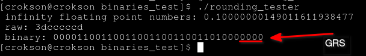

ta thấy đây là fraction sau khi IEEE754 đã hoàn tất quá trình encode và rounding, chứ không phải dãy bit vô hạn ban đầu và ta có `00001100110011001100110011010000000`

> Phần tính toán thủ công để lấy bit GRS và so sánh

<details>
	<summary>tính toán (encode) lại sang nhị phân</summary>

Để có thể xét, ta cần phải tính thủ công bằng tay. Encode số `0.1` theo chương [2.1.Encode](#21encode) thành nhị phân sao cho có phần bit bị cắt vượt quá 23 bit fraction. Lúc đó ta mới có thể thực hiện xét bit, rounding hay tính half ULP v.v. cũng hợp lệ vì ta đang dựng lại cách phần cứng thực sự tính toán số thực. Nhìn `0.1` ta biết ngay `sign = 0`, phần nguyên là 0 luôn bây giờ tính phần thập phân sang bit

| số  | nhân hai | bit lấy |
|-----|----------|---------|
| 0.1 | 0.2      | 0       |
| 0.2 | 0.4      | 0       |
| 0.4 | 0.8      | 0       |
| 0.8 | 1.6      | 1       |
| 0.6 | 1.2      | 1       |

`0.1` là số thực vô hạn, vòng tuần hoàn của nó là `0.1 -> (0.2 -> 0.4 -> 0.8 -> 0.6)` và quay lại `0.2` lần lượt theo trong ngoặc đơn. Vậy nên khi ta biết các bit của vòng tuần hoàn này là $$\large00011_{2}$$ ta tiến hành copy paste lên (vì dù sao cũng tính vẫn ra mà), nhưng bỏ bit ở số `0.1` đi ta có $$\large0011_{2}$$ vậy tiếp tục copy cho tới vượt qua 23bit fraction, ta có $$\large\boxed{00011001100110011001100110011_{2}}$$. Đây là nhị phân của phần fraction. Vậy còn sign ta có là `0` thì ta ghép vào đầu chuỗi nó sẽ thành như sau $$\large\boxed{\mathbf{0}00011001100110011001100110011_{2}}$$

đây là kết quả y chang như mã C đã tính cho chúng ta nhưng thực chất nó khác. Khác vì không có một bước trung gian nào khiến ta có thể bị che mắt, thay vào đó là tự tay tính để biết toàn bộ quá trình. Đây là cách chuẩn để lấy và so sánh GRS

</details>

**nhưng ở đây dù có nhị phân đã được in quá fraction là 34bit trong đoạn code C thì chúng ta vẫn sẽ ko đảm bảo thấy được GRS thật sự vì sao?**

vì nó là số vô hạn? hay vì nó ko ở đầu bit bị cắt như lý thuyết?, tất cả đều sai. Nguyên nhân là do, trước khi đưa số thực như `0.1` vào float thực tế là phần cứng đã làm việc, tính toán, xét GRS và rounding trong lúc chuyển đổi literal, nên GRS đã bị bỏ. Ta chỉ có là số kết quả đã được làm tròn ngay từ lúc gán nó vào biến a kiểu float, vậy nên dù ta có xét GRS bit hay làm thế nào với số kết quả này `0.10000000149011611938477` bao nhiêu lần đi chăng nữa thì điều đó càng thêm vô lý cũng như vô ích với kết quả được được tính sẵn thế này.

Nên mới nói, dù ta có xét GRS, tính và so sánh bao nhiêu half ULP nếu ko hiểu điều này rất dễ sinh nhầm lẫn là nhỏ hơn half ULP là giữ nguyên sao nó vẫn làm tròn, mà nó làm tròn bằng cách cộng 1 vào phần tử cuối fraction sao lại ra kết quả này (vì đó là số đã được tính và làm tròn trước khi gán vào float bởi phần cứng, GRS đã bị bại bỏ và chúng ta ko thể tính gì thêm nữa)

Muốn biết GRS của quá trình encode ban đầu thì phải quan sát chuỗi bit trước khi làm tròn, dù có thể tự động hóa nào đó như dùng casio hay các phép tính nhân chia v.v. nhưng việc encode thì phải thủ công để suy ra xét GRS chính xác nhất. **Ví dụ** đoạn code trên cho binary gần sát như binary đã caculated thủ công nhưng việc xét GRS về cơ bản thì hòan toàn sai vì chúng ta ko thể đảm bảo nó đúng

**Khác biệt giữa bit dùng để quyết định rounding và bit của kết quả sau khi rounding**

Bit dùng để quyết định rounding theo lý thuyết thường là 3bit đầu của bit bị cắt (đi quá fraction), bit của kết quả sau khi rounding thoáng qua giống với sự tính toán thủ công khi ta dùng các ngôn ngữ lập trình để tự động hóa nhưng về cơ bản chúng đã thực hiện rounding ở mức phần cứng và các bit thường sẽ ko đảm bảo chắc chắn là nó chính xác như tính tay hay tính tay chính xác hay ko. Loại bit của kết quả sau khi rounding là loại bit đã trải qua xử lý của phần cứng FPU để đưa ra kết quả **ví dụ như** output bit `00001100110011001100110011010000000` của đoạn C tính toán như trên là loại bit đã trải qua rounding

nhưng vấn đề khiến nó gần như trùng khớp với bit quyết định hay số thực được tính tay sang bit là sự sai số ở phần số thực diễn ra rất nhỏ xuất hiện tại bit bị cắt, hầu như còn nhỏ hơn 23-25 bit fraction. Để phân biệt hai loại bit này, ta cần phải hiễu rõ bit dùng để quyết định rounding phải chính xác (an toàn nhất là tính toán thủ công để lấy bit GRS), bit của kết quả sau khi rounding thường là bit của các chương trình nhị phân chẳng hạn như C tính toán, phần fraction luôn luôn là chính bit chuẩn xác, mức sai số chỉ xuất hiện với phần bit vượt quá phần fraction gọi là bit bị cắt và GRS cũng nằm ở 3bit đầu của phần bit bị cắt đó (Ta có thể tiếp tục tạo ra các bit phía sau từ giá trị float đã được làm tròn, nhưng các bit đó không còn là Guard, Round và Sticky bit của lần encode ban đầu. Chúng chỉ là các bit sinh ra từ giá trị đã được làm tròn)

</details>

#### 3.2.5.Thao tác Bitwise Raw Manipulation trên uint32_t

Ở đây, chúng ta sẽ thao tác chính xác bit thô trên `uint32_t`. Trước hêt, cần phải hiểu rõ thao tác số thực với FPU và `uint32_t` khác nhau thế nào :

| Tiêu chí | FPU | uint32_t |
|----------|-----|----------|
| **Bản chất** | Mạch phần cứng đại số số thực | Thao tác trên dãy 32 ô nhớ nhị phân |
| **Đơn vị xử lý** | Giá trị số thực | Mẫu bit thuần túy |
| **Xử lý số vô hạn** | Tự động làm tròn (GRS) theo chuẩn IEEE 754 | Không quan tâm giá trị, chỉ đọc/dịch/đảo bit |
| **Ngôn ngữ C** | Thực hiện qua các toán tử +, -, *, / trên float | Thực hiện qua memcpy, toán tử &, |, ^, <<, >> |

vậy thao tác bitwise raw manipulation trên `uint32_t` là dùng các toán tử bitwise như &, | , ^, << , >> và thực hiện với memcpy để thao tác với tầng bit thô của số thực, sau khi sao chép bit sang `uint32_t`, các phép toán tiếp theo (&, |, ^, <<, >>) chỉ thao tác trên mẫu bit, không kích hoạt các phép toán số thực của FPU, điều này tránh đụng chạm tới phần FPU vì các phép toán trên `uint32_t` không sử dụng pipeline số thực và chúng được thực hiện bởi ALU, không phải FPU do đó chúng ta có thể xử lý và đọc lượng bit đó một cách chính xác trong bộ nhớ

**Lưu ý** FPU vẫn có thể được sử dụng cho việc làm tròn, xử lý số thực sang phần nguyên hay nhi phân trước đó phổ biến khi gán `0.1f` vào một valriable, chương này chỉ thao tác nghĩa là dịch bit, dùng các phép toán nhị phân để thao tác với số thực thay cho cú pháp bình thường sẽ lỗi nếu thao tác trực tiếp với biến số thực

<details>
	<summary>ví dụ với C</summary>

```c
#include <stdio.h>
#include <stdint.h>
#include <string.h>

int main() {
    float a = 0.1f; //vẫn qua rounding
    uint32_t raw;
    
    // Bê nguyên 32 bit từ vùng nhớ của a sang raw
    memcpy(&raw, &a, sizeof(raw));

    // Tách 3 thành phần IEEE 754 bằng Bitwise operators
    uint32_t sign     = (raw >> 31) & 0x01; // Bit 31 là cái phần sign
    uint32_t exponent = (raw >> 23) & 0xFF; // Bit 23 -> 30 (8 bits) gán vô exponent
    uint32_t fraction = raw & 0x7FFFFF; // Bit 0 -> 22  (23 bits) fraction

    printf("Sign: %u\n", sign);
    printf("Exponent (Biased): %u (Actual: %d)\n", exponent, exponent - 127);
    printf("fraction (Raw Hex): 0x%06X\nFraction binary: ", fraction);

	//phần lấy mã nhị phân của trường fraction
	int o;
	for(int i = 22; i >= 0; i--){
		o = (fraction >> i) & 1;
		printf("%d",o);
	}
	printf("\n");

    return 0;
}
```

> gcc -o bitwise_manipulation bitwise_manipulation.c

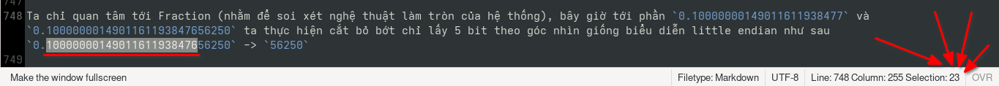

từ đoạn mã ta có sơ đồ biểu diễn logic như sau (để tránh gây hiểu lầm):

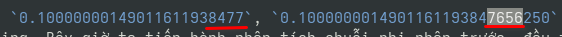

Vậy nên nó chỉ thao tác đọc ghi v.v. , chứ ko ngăn được FPU đã xử lý phần 0.1f

</details>

#### 3.2.6.Vì sao phần cứng biết vị trí của Guard, Round và Sticky Bit?

Thực tế, FPU không đi tìm Guard, Round, Sticky trong dữ liệu đã lưu. Ba bit này được phần cứng của FPU tạo ra tạm thời trong quá trình tính toán. Ba loại bit này không hề tồn tại trong bộ nhớ, nó chỉ là các bit tạm được FPU tạo ra vì chuẩn IEEE 754 định nghĩa việc làm tròn dựa trên các bit vượt quá độ chính xác lưu trữ. GRS là cách phần cứng biểu diễn các bit đó để quyết định các quy tắc làm tròn round to nearest tie to even thay vì tính một nữa khoảng cách hai giá trị (half ULP) và so sánh chúng. Sau khi ba bit này được FPU dùng và so sánh hoàn tất, chúng sẽ bị bác bỏ và các dãy nhị phân dù có trùng khớp là 3 bit cuối GRS (tùy trường hợp và ngữ cảnh) thì về bản chất đó chỉ là trùng hợp

> [!IMPORTANT]
> GRS được tạo ra từ kết quả trung gian trước khi làm tròn, rồi được dùng để quyết định cách làm tròn, sau khi làm tròn 3bit này bị bác bỏ và nếu có thể thấy 3bit cuối khi thực hiện dump nhị phân của số thực đó thực chất chỉ là sự trùng hợp

#### 3.3.Round toward zero

`Round toward Zero (làm tròn về 0 hay còn gọi là truncation)` là chế độ làm tròn trong đó phần lẻ bị loại bỏ, khiến kết quả luôn tiến gần về giá trị 0. Chế độ này không xét khoảng cách giữa hai số biểu diễn được như Round to Nearest, Ties to Even, mà chỉ đơn giản cắt bỏ phần không thể biểu diễn. **Ví dụ** :

| Giá trị | Kết quả |
|---------|---------|
| 3.9     | 3       |
| 3.1     | 3       |
| -3.9    | -3      |
| -3.1    | -3      |

Điểm hay bị nhầm `round toward zero` $$\large\neq$$ ceil và floor

> phần cho ceil và floor

<details>
	<summary>ceil và floor là gì</summary>

đây là hai hàm toán học dùng để làm tròn về phía trên hoặc phía dưới một số thực:

Floor (hàm sàn) luôn làm tròn về phía âm vô cực ($$\large-\infty$$) và có ký hiệu ($$\large\lfloor x \rfloor$$) định nghĩa của nó là số nguyên lớn nhất nhỏ hơn hoặc bằng x. **Ví dụ:** 

|  (x) | $$\large\lfloor x \rfloor$$ |
| ---: | -------: |
|  3.8 |        3 |
|  3.0 |        3 |
|  3.1 |        3 |
| -3.1 |       -4 |
| -3.8 |       -4 |

Ở đây, $$\large3 \leq 3.8$$ nên kết quả là 3, và $$\large-4 \leq -3.8$$ kết quả là -4 vì -4 là số nguyên lớn nhất thỏa điều kiện

Ceil (hàm trần) luôn làm tròn về phía dương vô cực ($$\large+\infty$$) và có ký hiệu $$\large\lceil x \rceil$$ định nghĩa của nó là số nguyên nhỏ nhất lớn hơn hoặc bằng x. **ví dụ:**

|  (x) | Ceil(x) |
| ---: | ------: |
|  3.1 |       4 |
|  3.8 |       4 |
|  3.0 |       3 |
| -3.1 |      -3 |
| -3.8 |      -3 |

Ở đây, $$\large4 \geq 3.1$$ nên kết quả là 4 và $$\large-3 \geq -3.1$$ nên kết quả là -3. Có thể mở rộng lý thuyết của hai hàm làm tròn này [tại đây](https://en-wikipedia-org.translate.goog/wiki/Floor_and_ceiling_functions?_x_tr_sl=en&_x_tr_tl=vi&_x_tr_hl=vi&_x_tr_pto=tc)

<details>
	<summary>dùng hàm floor(),ceil() trong thư viện math.h để tính floor,ceil trong C</summary>

```c
#include <math.h>
#include <stdio.h>

int main (void){
	printf(" floor 3.8 = %f\n ceil 3.8 = %f\n floor -3.8 = %f\n ceil -3.8 = %f\n",
	floor(3.8), // 3.0
	ceil(3.8), // 4.0

	floor(-3.8), // -4.0
	ceil(-3.8) // -3.0
	);
}
```

> gcc -o floor_ceil floor_ceil.c

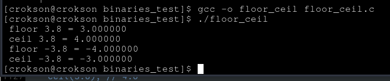

**Lưu ý:** `floor()` và `ceil()` trả về kiểu dấu phẩy động (double hoặc phiên bản tương ứng như `floorf()` cho `float`), không phải `int`. **Ví dụ** `floor(3.8)` trả về `3.0`, không phải `3`.

</details>

</details>

**so sánh floor, ceil và toward zero**

Ta cho bảng so sánh như sau:

| Giá trị | Toward Zero | Floor | Ceil |
| ------- | ----------: | ----: | ---: |
| 3.9     |           3 |     3 |    4 |
| -3.9    |          -3 |    -4 |   -3 |

đối với số âm thì sự khác biệt khá rõ, floor luôn đi về phía âm vô cực ($$\large-\infty$$) còn `round toward zero` luôn đi về 0. **Ví dụ** ta cho `-3.8` thì :

| Chế độ            | Kết quả |
| ----------------- | ------: |
| Floor             |      -4 |
| Ceil              |      -3 |
| Round toward Zero |      -3 |

ta thấy floor luôn làm tròn về $$\large-\infty$$ và ceil luôn làm tròn về $$\large+\infty$$ và `round toward zero` luôn tiến về số 0

> [!NOTE]
> **Lưu ý:** Đối với số dương, `Round toward Zero` và Floor cho cùng một kết quả. Đối với số âm, `Round toward Zero` và `Ceil` cho cùng một kết quả. Sự khác biệt chỉ xuất hiện khi số có phần lẻ.

Do đó, về cơ bản chương `round toward zero` này chỉ có vậy. Nếu chế độ làm tròn này được bật thì FPU ko cần phải xét GRS vì đó thuộc round to nearest tie to even

<details>
	<summary>liệu round toward zero và (int)x.x có phải là một ko?</summary>

Gần giống, nhưng chúng ko cùng một khái niệm. Trong nhiều ví dụ thì chế độ `round toward zero` cho kết quả khá tương đương với `(int)x.x` nhưng về bản chất thì `(int)x.x` là chỉ ép kiểu sang phần nguyên bỏ phần lẻ, điều này giống với hành vi của `round toward zero`. Nhưng có hai đặc điểm để chứng minh hai cái này khác: 

**đặc điểm thứ nhất:** là kết quả của `(int)x.x` nó là số nguyên nó bỏ phần số thực đi suy ra `3.3 = 3`, còn `round toward zero` cũng có kết quả giá trị nhưng nó biểu diễn dạng số thực `3.3 = 3.0` và `3.0` cùng giá trị với `3` nhưng khác cách trình bày

**đặc điểm thứ hai:** `(int)x.x` là chuyển đổi kiểu dữ liệu từ số thực sang số nguyên theo quy tắc của ngôn ngữ C. `Round toward Zero` là một chế độ làm tròn của IEEE 754 dùng cho các phép toán dấu phẩy động.

Nên nhiều ví dụ thấy chúng gần như tương đồng nhau nhưng chúng ko nằm chung một khái niệm

</details>

#### 3.3.1.biểu diễn làm tròn trên hệ nhị phân

Để hiểu sâu hơn chúng ta cần phải hiểu rõ là `round toward zero` nó tác động lên bit nhị phân như thế nào đã, ở phần chương vừa rồi ta có lập bảng so sánh ở hệ cơ số 10, nhưng bây giờ ta cần phải xem thêm nó tác động tới hệ cơ số 2 như thế nào ở phần tính toán thủ công và minh họa với C. Bây giờ **ví dụ** chỉ cho phép 4bit fraction để dễ quan sát, kết quả trung gian là `1.101011100...` trong đó nó giữ lại `1.1010` và bit bị cắt là `11100...`

`round toward zero` nó ko quan tâm bit bị bỏ là gì, ko xét GRS hay đi tính một nữa khoảng cách biểu diễn được (half ULP) như round to nearest tie to even cần, nó chỉ biết `1.1010` là xong, suy ra kết quả :

$$
\large1.101011100..._{2} \xrightarrow{\text{round toward zero}} \boxed{1.1010_{2}}
$$

Kết quả của nó là bit được giữ lại và ko ngó gì tới bit bị cắt, tương tự với số âm `-1.101011100...` :

$$
\large-1.101011100..._{2} \xrightarrow{\text{round toward zero}} \boxed{-1.1010_{2}}
$$

biểu diễn bit ở chế độ làm tròn này đơn giản chỉ có thế

<details>
	<summary>minh họa với C</summary>

```c
#include <stdio.h>
#include <fenv.h>

#pragma STDC FENV_ACCESS ON

int main(void){
	if (fesetround(FE_TOWARDZERO) != 0){
		printf("changed mode failed\n");
		return -1;
	} //chuyển đỏi sang round toward zero

	{
	volatile double a = 1.0;
    volatile double b = 10.0;
	double x = a / b;

    printf("%.20f\n", x);
	}

	volatile double a = 2.2;
	volatile double b = 3.4;
	double x = a * b;

	printf("%.20f\n", x);

	return 0;
}
```

> gcc -o round_toward_zero round_toward_zero.c -lm

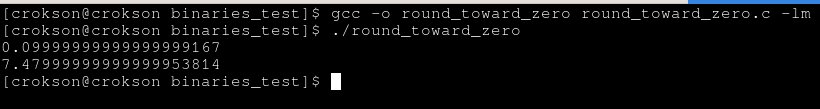

ta thấy `0.09999999999999999167` và `7.47999999999999953814`, đây chính là kết quả được làm tròn bởi `round toward zero`.

<details>
	<summary>Liệu sau khi chuyển chế độ sang round toward zero, thì FPU có thực hiện round to nearest tie to even khi gán số thực vào biến ko?</summary>

có thể có hoặc không, tùy thời điểm phép làm tròn diễn ra. Trường hợp đầu tiên là hằng số dấu phẩy động trong mã nguồn **ví dụ** `double a = 0.1;` số `0.1` trong mã nguồn ko thể biểu diễn chính xác theo IEEE, vì nó là số vô hạn (có thể biểu diễn số này vô hạn tuần hoàn nhưng toán hạng fraction là hữu hạn).

Để biểu diễn chính xác thì phải cần biết nó có phải số hữu hạn hay vô hạn. Về cơ bản thì nếu việc gán vào cho biến kiểu số thực là số vô hạn thì nó vẫn rounding theo round to nearest tie to even như thường, vì nó xảy ra trước rồi và nó đã hardcode trong file nhị phân (file thực thi sau khi biên dịch) rồi

Còn về trường hợp các phép tính sau này về số thực đó thì đúng, nó dùng `round toward zero` như đã được thiết lập vì đây là lúc FPU sử dụng các lệnh tính toán số thực và kết quả của các lệnh này mới chịu ảnh hưởng bởi rounding mode hiện tại. Nêu thiết lập chế độ làm tròn nào thì kết quả sẽ tuân theo chế độ đó 

Còn về trường hợp dùng định dạng chuỗi chuyển sang số thực nghĩa là từ `"2.2"` thành `2.2` lúc này các thư viện C sẽ chuyển thành số thực, và việc chuyển đổi này có thể chịu ảnh hưởng của rounding mode, tùy cách hiện thực của libc và chuẩn mà thư viện tuân theo.

**Tóm lại là vậy:** khi gán số thực vào valriable, số thực đã được compiler mã hóa sẵn trong quá trình biên dịch rồi. Và các phép toán như `a * b` thì lúc này mới tuân theo rounding mode hiện tại (rounding mode mà đã được thiết lập trong mã)

**Lưu ý:** `fesetround()` chỉ ảnh hưởng đến các phép toán dấu phẩy động được FPU thực hiện trong lúc chương trình chạy (runtime). Các hằng số dấu phẩy động như `2.2`, `3.14` hay `0.1` thường đã được compiler chuyển sang định dạng IEEE 754 trong quá trình biên dịch, nên không chịu ảnh hưởng của `fesetround()` được gọi sau đó.

</details>

Để biết được là `0.09999999999999999167` và `7.47999999999999953814` có phải là kết quả của `round toward zero` hay không thì trước hết phải biết các số thực được gán vào biến trong mã nguồn thuộc số thực vô hạn tuần hoàn hay hữu hạn. Bây giờ để có số liệu thì chúng ta lấy hai cái này đi encode sang nhị phân trước, encode giúp xác định chuỗi bit trước khi lưu vào IEEE 754, từ đó biết liệu giá trị toán học có biểu diễn hữu hạn hay vô hạn trong hệ nhị phân và hiểu vì sao FPU phải thực hiện làm tròn , với `0.09999999999999999167` ta có :

biết sign và phần nguyên có bit là `0` vậy nên ta chỉ cần nhân đôi thôi 

| phần số thực | nhân 2 | dư | giá trị bit |
|-----|--------|----|-------------|
| 0.09..167 | 0.2 | 0.2 | 0 |
| 0.2 | 0.4 | 0.4 | 0 |
| 0.4 | 0.8 | 0.8 | 0 |
| 0.8 | 1.6 | 0.6 | 1 |
| 0.6 | 1.2 | 0.2 | 1 |

ta có : `0.0001100011...000110 (4 phần kia bị cắt nên chỉ có bit 0)` và phần bị cắt là `0011` ta chuẩn hóa số thực này suy ra ta có `1.100011...000110` :

$$\Large
0.0001100011...000110_{2} \xrightarrow{\text{di chuyển dấu chấm sang phải 4 lần}} 1.100011...000110_{2}
$$

suy ra `actual exponent = -4` tính trường exponent là `exponent field = -4 + 1023 = 1019` và ta có $$\large1019_{10} = 01111111011_{2}$$ ráp lại ta có $$\large\boxed{0011111110110001100011...000110_{2}}$$ vậy ta thấy quá trình chuyển sang nhị phân xuất hiện chuỗi tuần hoàn `000110011...`, điều đó chứng tỏ giá trị toán học `0.09999999999999999167` không thể biểu diễn chính xác bằng khai triển nhị phân vô hạn. Khi encode sang IEEE 754, FPU sẽ cắt chuỗi này theo giới hạn 52 bit fraction (double) rồi làm tròn theo chế độ làm tròn hiện hành để tạo ra một mẫu bit hữu hạn.

Còn giá trị `7.47999999999999953814`, đầu tiên ta có `sign = 0` và $$\large7_{10} = 111_{2}$$ và tính fraction :

| phần số thực | nhân 2 | dư | giá trị bit |
|-----|--------|----|-------------|
| 0.4799..953814 | 0.96 | 0.96 | 0 |
| 0.96 | 1.92 | 0.92 | 1 |
| 0.92 | 1.84 | 0.84 | 1 |
| 0.84 | 1.68 | 0.68 | 1 |
| 0.68 | 1.36 | 0.36 | 1 |
| 0.36 | 0.72 | 0.72 | 0 |
| 0.72 | 1.44 | 0.44 | 1 |
| 0.44 | 0.88 | 0.88 | 0 |
| 0.88 | 1.76 | 0.76 | 0 |
| 0.76 | 1.52 | 0.52 | 1 |
| 0.52 | 1.04 | 0.04 | 1 |
| 0.04 | 0.08 | 0.08 | 0 |
| 0.08 | 0.16 | 0.16 | 0 |
| 0.16 | 0.32 | 0.32 | 0 |
| 0.32 | 0.64 | 0.64 | 0 |
| 0.64 | 1.28 | 0.28 | 1 |
| 0.28 | 0.56 | 0.56 | 0 |
| 0.56 | 1.12 | 0.12 | 1 |
| 0.12 | 0.24 | 0.24 | 0 |
| 0.24 | 0.48 | 0.48 | 0 |
| 0.48 | 0.96 | 0.96 | 0 |
| 0.96 | 1.92 | 0.92 | 1 |

ta có : `fraction = 0.111101001100001010001..010011 (11 bit bị cắt)` ta chuẩn hóa số thực thành `1.11101001100001010001..010011`:

$$\Large
0.111101001100001010001..010011_{2} \xrightarrow{\text{di chuyển dấu chấm sang phải 1 lần}} 1.11101001100001010001..010011_{2}
$$

suy ra `actual exponent = -1` ta tính `exponent field = -1 + 1023 = 1022` ta đổi $$\large1022_{10} = 01111111110_{2}$$ ta ráp lại thành $$\large\boxed{11101111111110111101001100001010001..010011_{2}}$$ ta thấy khi tính toán thì đoạn nhị phân này biểu diễn số thực vô hạn và có phần bị cắt là `00001010001`

**Vậy suy ra:** khai triển nhị phân của hai giá trị toán học `0.09999999999999999167` và `7.47999999999999953814` đều là chuỗi vô hạn tuần hoàn, nên không thể lưu chính xác trong định dạng IEEE 754 double. Trong quá trình biên dịch, compiler sẽ chuyển các hằng số dấu phẩy động này sang mẫu bit IEEE 754 gần nhất (thông thường theo quy tắc `round to nearest, ties to even`) rồi ghi trực tiếp mẫu bit đó vào file thực thi. Vì vậy, khi chương trình chạy, việc gán các hằng số này vào biến không chịu ảnh hưởng của `fesetround()`. Chỉ các phép toán dấu phẩy động được thực hiện trong runtime mới sử dụng rounding mode hiện hành.

Bây giờ theo tính toán để đoán ra dấu hiệu rõ của `round toward zero`, ta thấy các giá trị toán học khi thực hiện phép tính nó bị giảm đi một số rất nhỏ so với chuẩn toán học ban đầu. Ừm, nó không giống như rounding theo kiểu `round to nearest, tie to even` mà tăng lên hay giữ nguyên thay vào đó ở trường hợp này nó lại giảm xuống một chút cực kỳ nhỏ

suy ra chế độ làm tròn `round toward zero` khả năng cao đã hoạt động. Ta có thể dùng casio để biết rằng $$\large\frac{1.0}{10.0} = 0.1_{10}$$ , nếu là `round to nearest, tie to even` nó được giữ nguyên với giá trị `7.47999999999999953814` và `0.09999999999999999167` do `Guardbit = 0` nhưng ở đây nó lại giảm xuống suy ra có dấu hiệu chỉ giữ bit và bỏ luôn bit bị cắt đúng như lý thuyết vừa rồi. Nếu giữ nguyên thì vẫn là giá trị cao hơn so với giá trị này hay làm tròn 

nhưng về kỹ thuật chúng ta ko thể kết luận chính xác tuyệt đối được vì `round to nearest, tie to even` ko chỉ là tăng lên hay giữ nguyên, nó có thể tăng, giảm, giữ nguyên cả ba trường hợp tùy thuộc vào GRS có trong bit. Nhưng chắc chắn hai bit này nếu là `round to nearest, tie to even` thì sẽ giữ nguyên vì cả hai có guard bit là 0

**Nếu round to nearest mà nó nhỏ hơn half ULP thì nó giữ nguyên vậy chả khác gì hệ thống đã lấy bit bị cắt bỏ rồi và nó có hành vi giống round toward zero là lấy phần bit theo toán hạng fraction à?**

Trong trường hợp phần bị cắt nhỏ hơn ví dụ 0.5 ULP thì kết quả của `Round to Nearest, Ties to Even` và `Round Toward Zero` hoàn toàn có thể giống hệt nhau. Nhưng không đồng nghĩa hai thuật toán của chung tương đồng nhau, điều này khá hiếm có thể xảy ra ta có bảng so sánh :

| discarded part | Round-to-nearest      | Toward zero |
| -------------- | --------------------- | ----------- |
| <0.5 ULP       | giữ nguyên            | giữ nguyên  |
| =0.5 ULP       | even                  | giữ nguyên  |
| >0.5 ULP       | tăng/giảm tới nearest | giữ nguyên  |

và thấy nếu cùng nhỏ hơn half ULP thì cả hai có kết quả y như nhau

</details>