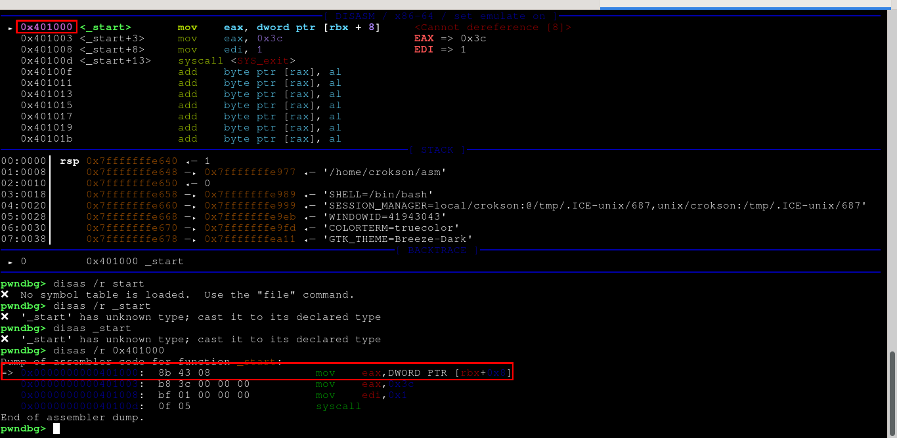
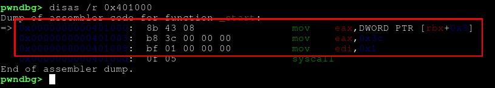

# CSAPP : Program Encoding

**Mục lục**

- [1.Tổng quan về Program Encoding](#1tổng-quan-về-program-encoding)
	- [1.1 Program Encoding là gì?](#11-program-encoding-là-gì)
	- [1.2 Quá trình từ mã nguồn C tới machine code](#12-quá-trình-từ-mã-nguồn-c-tới-machine-code)
	   - [1.2.1 Preprocessing](#121-preprocessing)
	   - [1.2.2 Compilation](#122-compilation)
	   - [1.2.3 Assembling](#123-assembling)
	   - [1.2.4 Linking](#124-linking)
	   - [1.2.5 CPU thực thi machine code](#125-cpu-thực-thi-machine-code)
	- [1.3. Assembly và Machine Code](#13-assembly-và-machine-code)
       - [1.3.1. Assembly không phải Machine Code](#131-assembly-không-phải-machine-code)
       - [1.3.2. Assembly là dạng biểu diễn gần với Machine Code](#132-assembly-là-dạng-biểu-diễn-gần-với-machine-code)
       - [1.3.3. Một Assembly instruction có thể có độ dài khác nhau](#133-một-assembly-instruction-có-thể-có-độ-dài-khác-nhau)
       - [1.3.4. Disassembler: đi từ Machine Code về Assembly](#134-disassembler-đi-từ-machine-codevề-assembly)
	   - [1.3.5. Phân biệt giữa byte opcode và các data/padding](#135-phân-biệt-giữa-byte-opcode-và-các-datapadding)
       - [1.3.6. Vì sao Reverse Engineering cần hiểu cả hai?](#136-vì-sao-reverse-engineering-cần-hiểu-cả-hai)
       - [1.3.7. Phân biệt giữa instruction, vaddr instruction, offset và assembly representation của instruction trong gdb](#137-phân-biệt-giữa-instruction-vaddr-instruction-offset-và-assembly-representation-của-instruction-trong-gdb)

- [2.Cấu trúc tổng quát của một Instruction](#2cấu-trúc-tổng-quát-của-một-instruction)
  - [2.1. Opcode](#21-opcode)
  - [2.2. Operand](#22-operand)
  - [2.3. Register Encoding](#23-register-encoding)
  - [2.4. Immediate Value](#24-immediate-value)
  - [2.5. Displacement](#25-displacement)
  - [2.6. Instruction Length](#26-instruction-length)

- [3. REX Prefix](#3-rex-prefix)
  - [3.1. REX Prefix là gì?](#31-rex-prefix-là-gì)
  - [3.2. Cấu trúc byte REX](#32-cấu-trúc-byte-rex)
  - [3.3. W, R, X và B](#33-w-r-x-và-b)
  - [3.4. Ví dụ giải mã REX](#34-ví-dụ-giải-mã-rex)

- [4. ModR/M Byte](#4-modrm-byte)
  - [4.1. ModR/M là gì?](#41-modrm-là-gì)
  - [4.2. Cấu trúc ModR/M](#42-cấu-trúc-modrm)
  - [4.3. Mod Field](#43-mod-field)
  - [4.4. Reg Field](#44-reg-field)
  - [4.5. R/M Field](#45-rm-field)
  - [4.6. Giải mã ModR/M bằng tay](#46-giải-mã-modrm-bằng-tay)

- [5. SIB Byte](#5-sib-byte)
  - [5.1. SIB là gì?](#51-sib-là-gì)
  - [5.2. Cấu trúc SIB](#52-cấu-trúc-sib)
  - [5.3. Scale](#53-scale)
  - [5.4. Index](#54-index)
  - [5.5. Base](#55-base)
  - [5.6. Công thức địa chỉ của SIB](#56-công-thức-địa-chỉ-của-sib)
  - [5.7. Giải mã SIB bằng tay](#57-giải-mã-sib-bằng-tay)

- [6. Ví dụ hoàn chỉnh](#6-ví-dụ-hoàn-chỉnh)
  - [6.1. Register → Register](#61-register--register)
  - [6.2. Register → Memory](#62-register--memory)
  - [6.3. Memory Addressing](#63-memory-addressing)
  - [6.4. Immediate Operand](#64-immediate-operand)
  - [6.5. Instruction có Displacement](#65-instruction-có-displacement)
  - [6.6. Instruction có SIB](#66-instruction-có-sib)
  - [6.7. Tự decode một Instruction hoàn chỉnh](#67-tự-decode-một-instruction-hoàn-chỉnh)

- [7. Từ Machine Code trở lại Assembly](#7-từ-machine-code-trở-lại-assembly)
  - [7.1. Disassembler hoạt động như thế nào?](#71-disassembler-hoạt-động-như-thế-nào)
  - [7.2. objdump](#72-objdump)
  - [7.3. GDB](#73-gdb)
  - [7.4. Ghidra](#74-ghidra)
  - [7.5. Đối chiếu Byte ↔ Assembly](#75-đối-chiếu-byte--assembly)

- [8. Object Code và ELF](#8-object-code-và-elf)
  - [8.1. Object File là gì?](#81-object-file-là-gì)
  - [8.2. Code Section](#82-code-section)
  - [8.3. Relocation](#83-relocation)
  - [8.4. Symbol và Symbol Table](#84-symbol-và-symbol-table)
  - [8.5. Từ Object File đến Executable](#85-từ-object-file-đến-executable)

- [9. Thực hành với Compiler](#9-thực-hành-với-compiler)
  - [9.1. gcc -S](#91-gcc--s)
  - [9.2. gcc -c](#92-gcc--c)
  - [9.3. objdump -d](#93-objdump--d)
  - [9.4. readelf](#94-readelf)
  - [9.5. So sánh Source → Assembly → Machine Code](#95-so-sánh-source--assembly--machine-code)

- [10. Tổng kết](#10-tổng-kết)
  - [10.1. Instruction được encode như thế nào?](#101-instruction-được-encode-như-thế-nào)
  - [10.2. Quy trình Decode một Instruction](#102-quy-trình-decode-một-instruction)
  - [10.3. Những gì cần nhớ](#103-những-gì-cần-nhớ)

---

## 1.Tổng quan về Program Encoding
### 1.1 Program Encoding là gì?

Khái niệm program encoding ko chỉ là một sản phẩm sau khi thông qua quá trình biên dịch từ ngôn ngữ lập trình sang mã máy mà CPU có thể hiểu được mà là cách chương trình được biểu diễn ở các mức khác nhau, đặc biệt trong ngữ cảnh CSAPP là cách mã nguồn được chuyển thành machine-level representation mà CPU thực thi, nói đơn giản program encoding là mã hóa các ngôn ngữ cho con người có thể đọc được dễ dàng thành ngôn ngữ máy cho máy tính làm việc thông qua các trình biên dịch

### 1.2 Quá trình từ mã nguồn C tới machine code
#### 1.2.1 Preprocessing

Quá trình này là quá trình đầu tiên, khi tiến hành biên dịch từ mã C tới mã máy mà máy tính có thể hiểu được compiler chèn in nguyên cái mã nguồn của các file tiêu đề ví dụ như (stdio.h, string.h v.v.) ở trên đầu logic C. Ví dụ :

```c
#include <stdio.h>

int main(void){
	printf("hello world\n");
	return 0;
}
```

trong khi tiêu đề (stdio.h) có khai báo `printf()`. Giả sử header có khai báo minh họa của `printf()` là :

```header
void printf(int a, int b, int c); //ví dụ minh họa
/*
Các hàm khác
*/
```

thì khi compiler làm việc thực hiện quá trình đầu tiên thì kết quả sẽ như này:

```c
void printf(int a, int b, int c); //ví dụ minh họa
/*
Các hàm khác
*/

int main(void){
	printf("hello world\n");
	return 0;
}
```

Ta thấy, nó chèn in nguyên cái mã nguồn của file tiêu đề vào cái phần `include`, cái ta `import` các thư viện vào để dùng các hàm như `printf()` hay `scanf()`. Ở quy trình đầu tiên preprocessing này nó có thể xử lý các thẻ như :

```c
#include
#define
#if
#ifdef
...
```

preprocessor thực hiện việc include nội dung header theo cơ chế của preprocessor, sau đó tạo ra translation unit đã được xử lý. Để có thể dừng ở phần đầu tiên và dump ra một file có thể cho ta xem toàn bộ quy trình kết quả sau khi preprocessing thực hiện hoàn tất, ta dùng lệnh `gcc -E main.c -o main.i` lệnh này ra lệnh cho compiler là khi thực hiện xong quy trình đầu tiên, thay vì biên dịch ra hay tới các quy trình khác thì hãy lưu kết quả của quy trình preprocessing vào file `main.i`, khi đó `main.i` là nơi chứa sản phẩm sau khi quy trình đầu tiên hoàn tất. Ta có thể truy cập vào file `main.i` để xem sản phẩm

#### 1.2.2 Compilation

Quá trình thứu 2 kế tiếp sau khi thực hiện qua quá trình preprocessing, quá trình này Compiler dịch mã C thành assembly, với cú pháp phụ thuộc vào compiler/option; GCC có thể xuất assembly theo AT&T hoặc Intel syntax. Ví dụ với at&t :

```asm
main:
    pushq   %rbp
    movq    %rsp, %rbp
    movl    $10, -4(%rbp)
    movl    $20, -8(%rbp)
    movl    -4(%rbp), %eax
    addl    -8(%rbp), %eax
    popq    %rbp
    ret
```

lúc này nó vẫn chưa phải mã thực thi, nó vẫn là hợp ngữ cho con người đọc được. Tác dụng nếu ta có thể hiểu sâu về phần này thì chúng ta cũng có thể ra lệnh compiler dump ra dạng mã ở quy trình bước 2 này để debug cũng là một ý tưởng khá hay ta có thể dùng lệnh `gcc -S main.c -o main.s`, lệnh này sẽ cho compiler biên dịch tới quá trình bước 2 ra một file, khi đó ta sẽ thấy được mã hợp ngữ được biên dịch từ C đầu vào qua

#### 1.2.3 Assembling

Quá tình này là quá trình số 3, ở đây Assembler sẽ dịch assembly thành machine-code bytes và tạo object file ở quy tình vừa rồi ở bước 2 sang mã máy vào một file object `(assembly -> .o files)`, file có đuôi `.o` này là một file chưa các mã máy được biên dịch từ hợp ngữ nên, thường là một ELF relocatable object trên Linux x86-64. Ta có thể kiểm tra qua lệnh `file` trên linux

Chúng ta có thể xem file dạng này với lệnh chẳng hạn như `gcc -c main.c -o main.o`, lệnh này ra lệnh cho compiler là thực hiện xong quy trình 3 là biên dịch hợp ngữ ra một file đuôi `.o` chẳng hạn `main.o`, hoặc chúng ta đã có file hợp ngữ như đã dùng lệnh `gcc -S main.c -o main.s` ở bước vừa rồi thì ta dùng lệnh `as main.s -o main.o` để biên dịch chúng ra, khi có file `.o` chẳng hạn `main.o` thì ta có thể dùng `objdump -d main.o` để xem machine code chẳng hạn như :

```
48 89 e5
48 83 ec 10
c7 45 fc 0a 00 00 00
```

Đây mới là những byte machine code tương ứng với các instruction.

#### 1.2.4 Linking

Khi đã biên dịch ra một file `.o` rồi, thì đây là bước 4 kế tiếp, một chương trình thực tế thường ko chỉ chứa code của `main.c` mà nó còn liên kết nhiều thư viện bên ngoài. Nên phần này góp phần để liên kết các nguồn logic bên ngoài ở các thư viện đã được import ở nguồn vào file nhị phân. Sau bước này, chương trình ko chỉ chứa code của `main.c` mà còn liên kết nhiều nguồn code khác như

```
main.o
   │
   │ static linker
   ▼
executable
   │
   ├── PLT
   ├── GOT
   ├── dynamic section
   └── DT_NEEDED → libc.so
                     │
                     ▼
              dynamic linker
                     │
                     ▼
             symbol resolution
```

> Với dynamically linked executable

Executable main vẫn chứa machine code, nhưng đồng thời còn có nhiều thành phần khác của ELF như section, symbol, relocation information, dynamic linking information,...

#### 1.2.5 CPU thực thi machine code

Sau khi hoàn tất quy trình bước 4 là linking, thực tế file output là Executable ELF thực thi hoàn chỉnh có thể thực thi được, tuy nhiên ko phải cứ nhập lệnh `./main` là hệ điều hành chọi nguyên dàn mã trong file vô cho CPU xử lý, còn vài bước mà hệ điều hành cần làm để có thể thực thi một file hoàn chỉnh thế này đó là

```
ELF executable
      │
      ▼
OS loader
      |
      |── đọc ELF headers
      |── tạo process address space
      |── map các loadable segments
      |── thiết lập permissions
      |── thiết lập entry point
      │
      ▼
Virtual Address Space
      │
      │   page tables
      │   VPN → PFN
      ▼
CPU bắt đầu tại entry point
      │
      ▼
   Fetch
      ↓
   Decode
      ↓
   Execute
      ↓
	 ...
```

> [!IMPORTANT]
> **Điều quan trọng:** Ở đây, CPU nó ko đọc từng byte,bit trực tiếp trong file nó chỉ thực thi instruction bytes nằm trong memory.

Cho một ví dụ như sau :

```
ELF file:

.text
--------------------------------
b8 3c 00 00 00
bf 01 00 00 00
0f 05
--------------------------------
          ↓ loader
RAM / virtual address space
          ↓
   RIP = 0x401000
          ↓
     CPU fetch:
   b8 3c 00 00 00
          ↓
       decode:
     mov eax, 0x3c
          ↓
       execute
```

Nghĩa là, khi dùng lệnh `./main`, các lệnh trong file ELF vốn đã được cấu trúc `.text, .data, .rodata v.v..` trước đó, nó là sản phẩm compiled, khi chương trình được khởi chạy, OS loader sẽ tạo address space cho process và map các loadable segments của ELF vào virtual address space. Các section như `.text`, `.data`, `.rodata` là khái niệm của ELF, loader chủ yếu làm việc với program headers / loadable segments, không đơn giản nạp từng section vào memory, với kernel thì vùng nhớ này được sắp xếp bởi page table ánh xạ virtual page number (VPN) sang physical frame number (PFN), cùng với các permission/status bits. Sau khi nạp xong vào vmem, CPU sẽ tiến hành xuất phát tại entry point (_start), theo sơ đồ minh họa entry point ở vaddr là `0x401000` và CPU tiến hành tại đây.

Tiếp đến là fetch. Fetch là quá trình CPU lấy các byte của instruction từ memory dựa trên địa chỉ hiện tại trong RIP, đưa chúng vào các thành phần bên trong CPU để tiếp tục xử lý, có thể hình dung thế này :

```
RAM / Virtual Memory
────────────────────────────────
0x401000:  b8
0x401001:  3c
0x401002:  00
0x401003:  00
0x401004:  00
0x401005:  bf
...
────────────────────────────────
                ▲
                │
             Fetch
                │
                │
               CPU
```

Trong reverse, ta cũng đã quen thuộc với RIP là một thanh ghi đặc biệt giữ địa chỉ của instruction tiếp theo mà CPU sẽ thực thi, ở đây như đã nói ở trên thì thanh ghi RIP hiện tại là đang ở vaddr `0x401000`, lúc này CPU biết instruction tiếp theo bắt đầu tại địa chỉ `0x401000`. Nếu `RIP=0x401000` thì CPU sẽ cần phải fetch để lấy instruction trong vmem về phía mình. Có thể hình dung :

```
RIP
 │
 │ 0x401000
 ▼
Memory
0x401000: b8
0x401001: 3c
0x401002: 00
0x401003: 00
0x401004: 00
```

> Để đơn giản hóa mô hình, ta giả sử CPU fetch đủ 5 byte cần thiết cho instruction này.

Nó sẽ đọc các byte trong bộ nhớ ảo (vmem) vào hệ thống CPU, kết quả sẽ là `b8 3c 00 00 00` đó là fetch. Chưa cần phải biết nó biên dịch ra hợp ngữ là sao

> [!IMPORTANT]
> **Điều quan trọng:** `RIP=0x401000` không có nghĩa CPU đọc đúng 5 byte ngay lập tức vì hardware thực tế không nhất thiết thực hiện một memory read đúng 5 byte vì nó biết trước instruction dài 5 byte.
>
> CPU hiện đại thường fetch instruction bytes theo cache lines / fetch blocks lớn hơn nhiều, sau đó instruction decoder xác định boundary của từng instruction.

<details>
	<summary><b>[Câu hỏi]</b> Vì sao CPU cần phải fetch?</summary>
<table>
<tr>
<td>

---


<sub>--đã hết phần giải thích--</sub>

---

</td>
</tr>
</table>
</details>

bước tiếp theo là decode, bước này là bước CPU phân tích chuỗi byte sau khi fetch từ vmem sang với chuỗi `b8 3c 00 00 00` thì CPU decode nó thành đại ý chẳng hạn như `MOV EAX, 0x3c`. Sau quá trình decode là tới quá trình execute, CPU sẽ thực hiện ngữ nghĩa (semantics) của instruction như `EAX <- 0x3c`, sau đó `RAX = 60` và CPU mới tới instruction kế tiếp là `0x401005`, vậy nên tổng quát toàn bộ quá trình là :

```
                  Virtual Memory
                       │
                       │
                 RIP = 0x401000
                       │
                       ▼
              ┌─────────────────┐
FETCH         │ đọc bytes       │
              │ b8 3c 00 00 00  │
              └────────┬────────┘
                       │
                       ▼
              ┌─────────────────┐
DECODE        │ phân tích       │
              │ b8 → MOV        │
              │ 3c → immediate  │
              └────────┬────────┘
                       │
                       ▼
              ┌─────────────────┐
EXECUTE       │ EAX ← 0x3c      │
              └─────────────────┘
```

> [!IMPORTANT]
> **Điểm quan trọng:** Về tổng quát thì ko phải là instruction kế tiếp CPU luôn là `RIP = RIP + instruction_length` mà còn có thể có các lệnh như `jmp`, `je`, `jz` v.v..

### 1.3. Assembly và Machine Code
#### 1.3.1. Assembly không phải Machine Code

Nhiều người thường rất hay nhầm và thường hợp machine code và hợp ngữ lại thành một. Nhưng đó là sai lầm nhầm lẫn tai hại nhất, ta cần phân biệt hợp ngữ `mov edi, 1` là textual representation và `BF 01 00 00 00` là encode representation, ta phải hiểu hợp ngữ sinh ra là cho con người có thể lập trình, đọc hiểu dễ dàng hơn còn machine code là dành cho CPU để thực hiện các quy trình `fetch -> decode -> execute` sau khi chạy lệnh thực thi `./main`

<details>
	<summary><b>[Câu hỏi]</b> Machine code liệu có phải mã nhị phân 0,1 cho máy tính có thể hiểu được?</summary>
<table>
<tr>
<td>

---

Machine code là tập hợp các byte biểu diễn các instruction dưới dạng encoding mà CPU của một kiến trúc/ISA cụ thể có thể fetch, decode và thực thi. Ở mức thấp nhất, các byte này được cấu thành từ các bit 0 và 1. Vậy nên việc gọi machine code là mã nhị phân là có thể, vì machine code được biểu diễn dưới dạng bit `0/1`.


Tuy nhiên CPU không hiểu một chuỗi 0 và 1 theo nghĩa trừu tượng. Vì CPU có một ISA và các quy tắc instruction encoding. **Ví dụ** với x86-64:

```
10111000 00111100 00000000 00000000 00000000
    │             │
    │             └── immediate = 0x3c
    │
    └── encoding của MOV EAX, imm32
```

CPU dựa vào quy tắc encoding của x86-64 để phân tích chuỗi bit đó thành:

```
b8 3c 00 00 00
       ↓
   MOV EAX, 0x3c
       ↓
   EAX ← 60
```

suy ra cùng là các byte `0/1`, nhưng cách phân chia và diễn giải chúng theo ISA mới quyết định chúng biểu diễn instruction nào.

<sub>--đã hết phần giải thích--</sub>

---

</td>
</tr>
</table>
</details>

#### 1.3.2. Assembly là dạng biểu diễn gần với Machine Code

Hợp ngữ ko phải là ngôn ngữ hoàn toàn độc lập với CPU, với chip `core i3` này hay chip `core i5` khác chẳng hạn, nếu như cùng một loại mã hợp ngữ may mắn chạy được và ổn định trên hai con chip `i3` và `i5` thì ko có nghĩa nó sẽ chạy được trên các con chip điện thoại thường có ngành kiến trúc như `arm` thay vì `amd` , vì thế hợp ngữ nó phụ thuộc rất mạnh vào instruction set architecture (ISA). **Ví dụ**, instruction `mov edi, 1` là instruction của x86-64. Một kiến trúc khác như ARM64 có instruction set và encoding hoàn toàn khác. Điều này có nghĩa:

```text
C
│
├──→ x86-64 Assembly
│        ↓
│    x86-64 Machine Code
│
└──→ ARM64 Assembly
         ↓
     ARM64 Machine Code
```

Cùng một chương trình C có thể được compiler dịch thành các instruction khác nhau tùy thuộc vào kiến trúc CPU mục tiêu. Điều này giúp ta cũng mang máng rằng `gcc` code dài ko chỉ riêng là xử lý các `optimiziter, compiler, assembler v.v..` mà còn phải làm thế nào để hỗ trợ đa nền tảng sao cho chương trình có thể thực hiện hành vi như ý đồ của C chỉ định

#### 1.3.3. Một Assembly instruction có thể có độ dài khác nhau

Điều rất quan trọng ở phần này rằng, ta ko nên nghĩ `"à, cứ một lệnh thế này sẽ là một length giống nhau"`, sai. Một lệnh instruction ko có nghĩa là một độ dài cùng giống nhau, chúng khác nhau vì nhiều thứ **ví dụ** các instruction khác nhau có thể chiếm số byte khác nhau:

<div align="center">

|Instruction | Machine Code |
|:-|:-:|
| ret                     | C3 |
| nop                     | 90 |
| mov edi, 1               | BF 01 00 00 00 |
| mov eax, 0x12345678     | B8 78 56 34 12 |

</div>

Vì thế CPU nó ko đơn giản là giả định số byte cố định vào một instruction, thay vào đó nó phải xác định ranh giới của từng instruction dựa trên encoding của nó. Đây cũng là một trong những lý do việc phân tích machine code x86-64 có thể phức tạp. Tuy nhiên, Machine Code không chỉ là một chuỗi số nhị phân ngẫu nhiên. **Ví dụ** `BF 01 00 00 00` ko phải là 5 byte độc lập, chúng cùng nhau mã hóa thành một instruction `mov edi, 1`

#### 1.3.4. Disassembler: đi từ Machine Code về Assembly

Disassembler là công cụ chuyển đổi từ mã máy sang hợp ngữ, công cụ nổi tiếng trong giới reverse engineering, cái này đơn giản là nó phân tích các opcode, mã máy có trong file ELF hay các file nhị phân được compiled ra từ trước đó, dựa vào ISA, instrution encoding để cho đầu ra là assembly representation :

```
Machine-code bytes
        │
        ▼
   Disassembler
        │
        │ dựa vào ISA + instruction encoding
        ▼
Assembly representation
```

Cái này chỉ giới thiệu sơ qua vì nó chỉ giới thiệu công cụ disassembler. Các disassembler nổi tiếng như (objdump, gdb, ghidra v.v.) nói chung nó thường tích hợp chung với các IDE reverse để phục vụ soi các hợp ngữ của mã máy trong file

#### 1.3.5. Phân biệt giữa byte opcode và các data/padding

Cái này cực kỳ quan trọng, khi ta reverse hay debug một binary gì đó, ta phải phân biệt được cái byte `0b 00 10 00 00` này và `01 2c 9c 10` kia, nó là data/padding, hay opcode, nếu ko chúng ta rất dễ tốn time và đưa ra kết luận sai hoàn toàn chỉ vì lỗi nghiêm trọng tai hại này. Cách phân biệt buộc ta phải biết các bảng quy định opcode nó luôn có điểm khởi đầu và điểm kết thúc, nếu các byte có giá trị vượt quá điểm kết thúc của ISA quy định thì byte đó chắc chắn ko phải là opcode, mà là có thể là byte khác, có thể là operand, trường khác hoặc byte thuộc vùng miền khác

Tuy nhiên các byte ko nằm trong vùng opcode ko có nghĩa là nó ko thành một instruction mà bỏ đi, nó có thể là thanh ghi, hay là một byte có thể góp phần liên kết vào các opcode để tạo nên một instruction. **Ví dụ** `48 89 e5` ko phải:

```
48 = opcode
89 = rác
e5 = rác
```

mà nó là một instruction hoàn chỉnh `mov rbp, rsp`. Trong đó `48` là REX prefix, `89` là opcode, `e5` là ModR/M. Ngược lại, một byte thực sự nằm trong vùng padding hoặc data thì có thể không phải instruction. Vấn đề của reverse engineering là xác định ranh giới code/data và cách giải mã bytes, chứ không chỉ nhìn một byte rồi phán nó là opcode hay rác.

#### 1.3.6. Vì sao Reverse Engineering cần hiểu cả hai?

Hiểu cả hai hợp ngữ và opcode, giúp reverse egineer có cái nhìn chính xác về rev vì chỉ hiểu hợp ngữ hoàn toàn ko đủ khi rev. Các lý do quan trọng: 

- 1. **Thứ nhất:** hiểu machine code cho ta biết những byte thực sự tồn tại trong binary, còn hiểu hợp ngữ assembly cho ta một cách biểu diễn dễ đọc hơn về ý nghĩa của những byte đó. 

- 2. **Thứ hai:** hiểu machine code giúp ta biết và bypass kỹ thuật làm rối mã thay đổi byte code fake, ko nghe nhầm, ko viễn vông và nó có thật khá lâu ở các mã độc chuyên sâu. Một khi mã độc fake hay can thiệp vào các byte code trong binary chính nó chính các công cụ như `GDB, ghidra, objdump, v.v.` đều phán đoán hợp ngữ sai hoàn toàn, hơn nữa ghidra có decompiler C, một khi hợp ngữ sai thì mã C decompiled ra cũng sai theo dây chuyền

- 3. **Thứ ba:** hiểu machine code giúp phán đoán kiểu dữ liệu khi đọc hợp ngữ, tuy có decompiler nhưng vấn đề nó khá sai xót, đôi khi nó chỉ là `undenifined8` còn lại ta tự đoán, việc hiểu các byte machine code, đếm nó và thêm các kỹ thuật khác như nhìn thanh ghi v.v.. đều góp phần phán đoán chính xác hơn kiểu dữ liệu trong mã. Nếu đoán sai kiểu dữ liệu, hậu quả có thể gây sai sót dây chuyền khi phân tích bit bù hai hay là các hành vi của mã

#### 1.3.7. Phân biệt giữa instruction, vaddr instruction, offset và assembly representation của instruction trong gdb

Rất nhiều người nhầm giữ instrution, offset và assembly representation của một instrution ở gdb khi disas nó ra ví dụ một đoạn như sau :

```asm
0x0000555555555151 <+8>:  64 48 8b 04 25 28 00 00 00    mov rax,QWORD PTR fs:0x28
```

Họ khá dễ nhầm `0x0000555555555151` là instrution, thực chất nó là vaddr của instrution đó. Ta có thể biểu diễn nó như sau:

```
0x0000555555555151
        │
        └── địa chỉ ảo (virtual address) của instruction

<+8>
 │
 └── offset của instruction so với đầu hàm main

64 48 8b 04 25 28 00 00 00
│
└── machine-code bytes của instruction

mov rax,QWORD PTR fs:0x28
│
└── assembly representation của instruction đó
```

Trong đó `0x0000555555555151` nó ko phải instrution, mà nó là địa chỉ ảo (vaddr) trỏ tới instruction. `<+8>` nó ko phải con số vô nghĩa, nó là khoảng cách offset từ mốc có thể là (main, _start) đến địa chỉ trỏ tới instruction. Còn dãy `64 48 8b 04 25 28 00 00 00` là là instruction encoding / instruction bytes, còn `mov rax,QWORD PTR fs:0x28` chính là assembly representation của instruction đây là sản phẩm sau khi qua biên dịch lại thành hợp ngữ mà con người có thể đọc được

Nói chung, instruction thực sự nó có hai cách biểu diễn, một là byte tổng quát của instrution như `64 48 8b 04 25 28 00 00 00`, theo structure, hai là assembly representation như `mov rax,QWORD PTR fs:0x28` còn `0x0000555555555151` là địa chỉ ảo (vaddr) trỏ tới instruction

---

## 2.Cấu trúc tổng quát của một Instruction

Một instruction ở cấp machine code không nhất thiết chỉ gồm một byte opcode. Đặc biệt với x86-64, một instruction có thể được tạo thành từ nhiều thành phần khác nhau, trong đó mỗi thành phần đảm nhiệm một vai trò nhất định trong việc mô tả instruction.

Một mô hình tổng quát thường được biểu diễn như sau:

```
┌──────────┬────────┬────────┬──────┬──────────────┬──────────────┐
│ Prefixes │ Opcode │ ModR/M │ SIB  │ Displacement │ Immediate    │
└──────────┴────────┴────────┴──────┴──────────────┴──────────────┘
```
Tuy nhiên, không phải instruction nào cũng có đầy đủ tất cả các thành phần trên. Tùy instruction, một hoặc nhiều trường có thể không xuất hiện. **Ví dụ**, `b8 3c 00 00 00`, có thể được disassemble thành `mov eax, 0x3c` Trong trường hợp này, encoding có thể được nhìn đơn giản như:

```
┌────────┬──────────────────────────┐
│ Opcode │ Immediate                │
├────────┼──────────────────────────┤
│   b8   │ 3c 00 00 00              │
└────────┴──────────────────────────┘
```

Trong đó:

```
b8
│
└── Opcode / opcode form

3c 00 00 00
│
└── imm32 = 0x0000003c

```

CPU không nhìn chuỗi này dưới dạng chữ `mov eax, 0x3c`, mà nhận được các instruction bytes `b8 3c 00 00 00`. Sau đó decoder sử dụng quy tắc instruction encoding của ISA để xác định instruction tương ứng.

<details>
	<summary><b>[Câu hỏi]</b> Làm thế nào để nhận biết các byte đó thuộc cấu trúc trường nào của instruction?</summary>
<table>
<tr>
<td>

---

Thoáng qua ta thấy ví dụ bên trên, ta thấy trước ví dụ là một bảng cấu trúc, nhưng ta cũng thấy dòng chữ ko phải cứ instruction nào cũng tuân theo hết các cấu trúc trên. Vậy bây giờ vì sao và làm thế nào để ta biết `b8` là thuộc trường opcode và `3c 00 00 00` là thuộc trường immediate (`imm32`), ta cần hiểu CPU không tự đoán dựa trên hình dạng của byte. Nó dựa vào quy tắc encoding được ISA định nghĩa cho từng instruction form.

Có thể hình dung Instruction Encoding giống như một grammar (ngữ pháp). **Ví dụ**, một encoding form có thể quy định `B8+rd id`. Trong đó:

```
B8+rd → opcode + mã register, là một opcode encoding form
		trong đó rd được mã hóa trong 3 bit thấp của opcode.
id    → immediate 32-bit
```

Khi decoder gặp `b8`, nó tra cứu quy tắc tương ứng và nhận ra rằng byte này thuộc form `B8+rd`, `imm32`, `b8` tương ứng với `B8 + 0`, nên register được chọn là `EAX`. Sau đó quy tắc của encoding cho biết instruction này còn cần một `imm32`. Do đó 4 byte tiếp theo được diễn giải là immediate:

```
b8 | 3c 00 00 00
│       │
│       └── imm32
│
└── opcode/form
```

Vì x86 sử dụng little-endian cho immediate nhiều byte:

```
3c 00 00 00
        ↓
0x0000003c
```

Kết quả là `mov eax, 0x3c`. Điểm quan trọng nằm ở đây:

```
b8
│
│ decode
▼
B8+rd, imm32
│
├── rd   → xác định register
│
└── imm32 → yêu cầu 4 byte tiếp theo
                    │
                    ▼
             3c 00 00 00
```

Tức là byte `3c` không tự nói rằng nó là immediate. Chính instruction form được xác định từ các byte phía trước quy định rằng những byte tiếp theo phải được diễn giải như `imm32`.

<sub>--đã hết phần giải thích--</sub>

---

</td>
</tr>
</table>
</details>

### 2.1. Opcode

Opcode là trường encoding xác định operation/instruction form. Trong x86-64, opcode thường xuất hiện sau các prefix nếu instruction có prefix. Nghĩa là mã nhị phân (hoặc mã hex) dùng để xác định phép toán mà CPU sẽ thực hiện. Bây giờ đơn giản, ta lấy lệnh hợp ngữ làm minh họa, bây giờ ta muốn thực hiện phép cộng với `32bit/6bit`, ta dùng lệnh `add` với hợp ngữ nhưng với opcode nó là `05`. Ta dựa vào đó so sánh như sau :

<div align="center">

| nhu cầu | hợp ngữ | opcode | giải thích lệnh opcode |
|:-|:-:|:-:|:-|
| cộng | `add` | `05` (32/16bits) | `05` là việc cộng accumulator, imm32 |
| trừ | `sub` | `2D id` hoặc `2B /r` | `2D id` là việc trừ giá trị tức thời, còn `2B /r` là trừ nội dung thanh ghi/bộ nhớ vào thanh ghi |
| ... | ... | ... | ... |

</div>

ta thấy, lệnh hợp ngữ khi thao tác các nhu cầu hay hành vi, phép toán của CPU thì điển hành sẽ là lệnh riêng của nó như `add,sub,imul,div,v.v..` còn opcode thì cũng y chang, nhưng cái lệnh của nó sâu hơn và chi tiết hơn hợp ngữ, ví dụ muốn cộng nhưng cộng bao nhiêu bit, muốn cộng `32/16bits` thì dùng `05`, còn muốn trừ thì trừ ở đâu, trừ gía trị gì, trừ nội dung hay trừ gía trị tức thời. Nói chung nếu hợp ngữ sâu hơn C, thì opcode sâu hơn hợp ngữ, thế thì hợp ngữ cũng đâu phải là ác mộng lắm đâu

### 2.2. Operand

Operand là các đối tượng mà instruction thao tác lên, chẳng hạn register, memory operand hoặc immediate. Trong machine-code encoding, thông tin mô tả operand có thể được mã hóa thông qua `ModR/M`, `SIB`, `immediate`, `displacement` và các trường khác, vì vậy operand không nhất thiết tương ứng với một vùng byte riêng nằm ngay sau opcode. Dựa vào đó, ta thấy một lệnh máy thường có cấu trúc :

```
[ Opcode ] + [ Operand 1 ] + [ Operand 2 ] + … (có thể có thêm)
```

và lấy minh họa hợp ngữ, nếu `add` là cộng, CPU hiểu à nó là cộng nhưng nó cần biết thực hiện phép cộng ở phần nào với phần nào, bây giờ ta cập nhật lệnh hợp ngữ thành `add eax, 1` lúc này CPU hiểu `à cộng 1 vào thanh ghi eax`. Thì operand cũng y thế, ví dụ `05` là opcode cộng `32/16bits` thì cần phải cung cấp cộng vào ở các mục tiêu gì, lúc này cập nhật thêm operand để cộng 1 vào thanh ghi `05 01 00 00 00`

Ta lưu ý số bit, thanh ghi rax là 64bits hoàn toàn cao so với `32bits`, ở byte `05 01 00 00 00` chỉ thực hiện tương đương lệnh `add eax, 1` thôi, thực tế ở đây khi dùng opcode `05` là nó đã thêm cái thanh ghi eax rồi, nên `01 00 00 00` là gía trị 1, theo little endian.

<details>
	<summary><b>[Câu hỏi]</b> Vì sao thay vì để riêng 01, thì lại thêm các byte 00 00 00 phía sau?</summary>
<table>
<tr>
<td>

---

Đây đơn giản là lắp đầy cái phần trống của một lệnh với những byte có ý nghĩa, nếu như một `short -> int` qua compiler nó cũng sẽ dùng zero extension hoặc sign extension để lắp đầy phần dư từ `2byte -> 4byte`, thì cái này cũng vậy. Nói cho rõ thì byte `05` là opcode/encoding form của `ADD EAX, imm32`, nó bắt buộc có một trường immediate 32-bit, tức là sau `05` phải có đúng 4 byte immediate. Ta thấy `01` là 1 byte, nếu chỉ y nguyên thế này thì `3 byte còn lại tính sao?`, nên hệ thống sẽ thực hiện thêm các byte điển hình 3 null byte như trên `00 00 00` để lắp đầy 32bits.

- **Vì sao lại là null byte?:** Đây ko phải là quy tắc cứng nhắc gì, nó chỉ đơn giản đảm bảo giá trị ban đầu ko bị thay đổi sau khi lắp đầy, ở đây `01 00 00 00` là 32bit/4byte đủ, nhưng hệ thống sẽ đọc theo little endianess (byte có trọng số thấp nhất sẽ đứng trước) như sau `01 00 00 00 -> 00 00 00 01`, giá trị sẽ là `1` nhưng vẫn giữ nguyên đủ 32bits/4byte

  **Lưu ý:** Chúng ta ko nên gọi việc thêm các byte vào như thế là padding, việc gọi như thế là sai. Nó là thêm byte có ý nghĩa mặc dù thêm các null byte (`00`) như đợt vừa rồi thì chả có ý nghĩa gì, nhưng nếu nói `ý nghĩa của nó là lắp đầy độ rộng thì chả phải padding?` thì ta cho **ví dụ** nếu thử đổi `01 00 00 00 -> 01 76 54 32` thì little endianess `01 76 54 32 -> 32 54 76 01` thì nó là các byte có ý nghĩa

  nếu việc nói này là padding thì sai hoàn toàn bản chất padding, vì nó chỉ giữ nguyên một giá trị, còn nhìn ở đây mà xem nó lộn xộn nếu mà nói padding theo bản chất của nó thì sẽ thành ra sai kết quả mất. Đó là lý do vì sao ko nên nói padding trong trường hợp này, dù là các null byte thì phải diễn đạt nó là các byte có ý nghĩa trong việc lắp đầy độ rộng toán hạng

<sub>--đã hết phần giải thích--</sub>

---

</td>
</tr>
</table>
</details>

### 2.3. Register Encoding

Register Encoding là cách mà x86 biến tên thanh ghi như `EAX, ECX, R8, RDI, v..v..` thành các bit/field nằm trong instruction encoding. Điểm quan trọng là CPU không lưu chữ EAX trong instruction. **Ví dụ** cho `mov eax, 1` CPU ko lưu nó như `MOV EAX, 1` mà nó lưu `B8 + register_code | imm32`, trong đó `eax` có register code là `000` và `B8 + 000 = B8` nên `B8 01 00 00 00`. Dựa vào đó ta có bảng `REG values` như sau :

<div align="center">

| REG values | 8bits | 16bits | 32bits |
|-|-|-|-|
| 000 | al | ax | eax |
| 001 | cl | cx | ecx |
| 010 | dl | dx | edx |
| 011 | bl | bx | ebx |
| 100 | ah | sp | esp |
| 101 | ch | bp | ebp |
| 110 | dh | si | esi |
| 111 | bh | di | edi |

</div>

> [!IMPORTANT]
> Register code không phải địa chỉ của register. mã định danh thanh ghi trong encoding, không phải `edi = địa chỉ a`, `eax = địa chỉ b`, mà nó kiểu `edi = mã số` và opcode cộng mã số đó để thực hiện lệnh với thanh ghi có mã số đó
>
> Với các thanh ghi 8-bit mã `100–111`, ý nghĩa phụ thuộc vào việc instruction có REX prefix hay không, không có REX thì tương ứng `AH/CH/DH/BH` có REX thì tương ứng `SPL/BPL/SIL/DIL`.

Ngoài các encode cộng các mã thanh ghi vào opcode, còn có các chế độ mà Intel định nghĩa một encoding form kiểu `B8+rd ib/iw/id/iq`, trong đó `rd` đại diện cho mã thanh ghi đích. Bây giờ cho các ví dụ :

```
mov ecx, 1 -> B8 + 001 = B9 => B9 01 00 00 00
mov edx, 1 -> B8 + 010 = BA => BA 01 00 00 00
mov ebx, 1 -> B8 + 011 = BB => BB 01 00 00 00
mov esp, 1 -> B8 + 100 = BC => BC 01 00 00 00
mov ebp, 1 -> B8 + 101 = BD => BD 01 00 00 00
mov esi, 1 -> B8 + 110 = BE => BE 01 00 00 00
mov edi, 1 -> B8 + 111 = BF => BF 01 00 00 00
```

Nhưng x86 không phải lúc nào cũng encode register trong opcode lý giải chi tiết tại chương [4. ModR/M Byte](#4-modrm-byte). Cho **Ví dụ**, `mov eax, ebx` lệnh này không dùng kiểu `B8+rd` như `mov eax, imm32`. Nó có dạng `opcode | ModR/M` và encoding là `89 D8` và ta chuyển `D8` thành binary là `11011000`. ModR/M có cấu trúc như sau:

```
┌──────┬───────┬───────┐
│ mod  │ reg   │ r/m   │
│  2b  │  3b   │  3b   │
└──────┴───────┴───────┘
```

với `11011000` ta có :

```
11 | 011 | 000
│     │     │
│     │     └── r/m = 000 → EAX
│     └──────── reg = 011 → EBX
└────────────── mod = 11 → register
```

vì thế `89 D8` được encode thành `mov eax, ebx`. Ở đây register encoding nằm trong `ModR/M`, chứ không nằm trực tiếp trong opcode. `ModR/M` sẽ đươc nói rõ ở chương dưới

- **Vậy khi nào register code được mã hóa trong opcode, và khi nào được mã hóa trong ModR/M?:** Vị trí mã hóa thanh ghi phụ thuộc vào encoding form mà ISA x86 định nghĩa cho instruction, không chỉ phụ thuộc vào hành vi của lệnh. **Ví dụ**, với `mov eax, 1`, instruction sử dụng encoding form `B8+rd id`. Trong dạng này, mã thanh ghi đích được gắn vào opcode, với `EAX`, register code là `000`, vì vậy opcode là `B8`. Immediate 32-bit có giá trị `1` được mã hóa thành `01 00 00 00`, tạo thành instruction `B8 01 00 00 00`.

  Ngược lại, với `mov eax, ebx`, instruction sử dụng opcode `89` cùng một byte ModR/M. Trường `reg` biểu diễn thanh ghi nguồn `EBX`, còn trường `r/m` biểu diễn thanh ghi đích `EAX`. Vì vậy, encoding là `89 D8`. Không phải mọi instruction có immediate đều mã hóa register code trong opcode, cũng không phải mọi instruction thao tác giữa hai thanh ghi đều bắt buộc dùng ModR/M theo cùng một cách. Chẳng hạn, `add eax, 1` có thể dùng opcode `05` với thanh ghi tích lũy `EAX` được ngầm định, trong khi `add ecx, 1` có thể dùng opcode `83` và ModR/M để biểu diễn toán hạng đích `ECX`.

  Do đó, khi reverse engineering, cần xác định encoding form của instruction trước, sau đó mới phân tích cách các trường opcode, ModR/M, SIB, displacement và immediate biểu diễn toán hạng cụ thể.


### 2.4. Immediate Value

Immediate value (giá trị tức thời) là một giá trị hằng được mã hóa trực tiếp trong instruction, thay vì được lấy từ một thanh ghi hoặc đọc từ một địa chỉ bộ nhớ do toán hạng chỉ định. **Ví dụ** xét instruction sau `mov eax,1`, ý nghĩa này là gắn giá trị `1` vào thanh ghi `eax`, trong đó `1` là giá trị tức thời (immediate values) và `eax` là thanh ghi đích.

Đối với các instruction ecode như `b8 01 00 00 00`, ta thấy và có thể phân tích `b8` là opcode của encoding form `MOV r32, imm32` khi mã thanh ghi đích là `EAX`, dạng tổng quát được mô tả là `B8+rd id`, trong đó `rd` mã hóa thanh ghi đích và `01 00 00 00` là Immediate 32-bit có giá trị số học là 1, được mã hóa theo little-endian

Điều này cho thấy CPU không lưu chuỗi văn bản `mov eax, 1` trong instruction. Thay vào đó, instruction được biểu diễn bằng các byte mã máy, trong đó immediate value được mã hóa thành một trường dữ liệu của instruction. Tuy nhiên, immediate ko phải là thanh ghi hay bộ nhớ cao siêu gì, ta cần phân biệt rõ ba loại toán hạng sau :

```asm
mov eax, 1 
mov eax, ebx 
mov eax, DWORD PTR [rbx]
```

Trong đó :

- `mov eax, 1`: có loại toán hạng nguồn là immediate, có tác dụng là gán giá trị `1` vào thanh ghi `eax`.
- `mov eax, ebx`: có loại toán hạng nguồn là register, có tác dụng là lấy giá trị hiện tại của thanh ghi `ebx` gán vào thanh ghi `eax`
- `mov eax, DWORD PTR [rbx]`: có loại toán hạng nguồn là memory, có tác dụng là đọc 4 byte từ địa chỉ bộ nhớ được chứa trong `RBX` và gán vào thanh ghi `eax`

Ta thấy, trong trường hợp đầu tiên, giá trị 1 được chứa trong encoding của instruction. Trong trường hợp thứ hai, giá trị nguồn được lấy từ thanh ghi. Trong trường hợp thứ ba, CPU truy cập bộ nhớ để lấy dữ liệu. Vì vậy, immediate value là một phần của encoding, chứ bản thân nó không phải tên thanh ghi hay địa chỉ bộ nhớ.

Immediate value có thể được mã hóa bằng các kích thước khác nhau, tùy thuộc vào encoding form và instruction cụ thể. Các kích thước thường gặp gồm `8 bit`, `16 bit`, `32 bit` và trong một số encoding form là `64 bit`. **Ví dụ** `mov eax, 1` ta biết instruction encoding của nó là `b8 01 00 00 00` immediate `01 00 00 00` được mã hóa bằng `32bits` nghĩa giá trị số học của trường này là `0x00000001`, do x86 sử dụng little-endian cho các trường số nhiều byte, byte ít quan trọng nhất được lưu trước

Một **ví dụ khác**, ta cho `add ecx, 1` có thể được mã hóa thành `83 C1 01`, trong encoding của form này `83` là opcode, `C1` là byte `ModR/M`, xác định toán hạng thanh ghi và phép toán theo encoding form, `01` là immediate `8bits`. Ta thấy cùng giá trị là `1` gán vào thanh ghi nhưng lệnh `mov eax, 1` là `32bits` nhưng với `add ecx, 1` nó lại là `8bits`, chênh lệch khá lớn, như vậy cùng một giá trị số học 1 có thể được biểu diễn bằng số lượng byte khác nhau tùy theo encoding form. Không thể xác định kích thước immediate chỉ dựa vào giá trị số học của nó.

Một số instruction encoding sử dụng immediate có kích thước nhỏ hơn toán hạng đích. Khi đó, kiến trúc x86 có thể quy định sign extension mở rộng dấu để chuyển immediate sang kích thước cần thiết. **Ví dụ** trong `64bits` ta có `add rax, -1`, ta thấy một encoding có thể sử dụng dạng `REX.W + 83 /0 ib`, trong đó immediate là `8bits`. Giá trị `-1` được biểu diễn ở dạng bù hai `8bits` là `FF`, khi sign extension lên `64bits` giá trị sẽ thành `0xFFFFFFFFFFFFFFFF`. Ta cần phân biệt:

- **Immediate field:** các byte thực sự có trong instruction encoding.
- **Sign extension:** cách CPU mở rộng giá trị immediate theo quy tắc của instruction.
- **Zero extension:** mở rộng bằng các bit 0; chỉ áp dụng khi ngữ nghĩa của instruction quy định như vậy.

Tuy nhiên không phải mọi immediate đều được sign-extend. Cách diễn giải phụ thuộc vào instruction và encoding form cụ thể.

### 2.5. Displacement

Trong x86-64, displacement là một giá trị được mã hóa trực tiếp trong instruction, dùng làm độ lệch khi tính địa chỉ hiệu dụng của toán hạng bộ nhớ. Nó thường được cộng với địa chỉ cơ sở (base) hoặc địa chỉ chỉ số (index) đã được nhân với hệ số (scale).

> [!IMPORTANT]
> displacement không phải bản thân địa chỉ bộ nhớ. Nó là một thành phần có thể được CPU dùng để tính địa chỉ cần truy cập.

**Ví dụ** xét instruction `mov eax, DWORD PTR [rbx + 8]` ý nghĩa của nó là đọc 4 byte từ địa chỉ `RBX + 8`, sau đó ghi dữ liệu vào `EAX`. Bây giờ giả sử ta cho địa chỉ cơ sở là `0x1000` thì `+8` là displacement, suy ra ta có `0x1000 + 8 = 0x1008` và kết quả địa chỉ `0x1008` chính là địa chỉ mà CPU truy cập để lấy 4byte trong đó

- **Displacement xuất hiện như thế nào trong machine code?:** Nó sẽ thành thế này `8B 43 08` và instruction encode này là của `mov eax, DWORD PTR [rbx + 8]`. Bây giờ ta bật GDB lên thực chiến luôn, vì cái câu hỏi này sẽ dễ hiểu hơn khi ta thực chiến. Ta cho code hợp ngữ sau:

  ```asm
   section .text
	global _start
  _start:
	  mov eax, dword [rbx + 8]
	  mov eax, 60
	  mov rdi, 1
	  syscall
  ```

  > nasm -f elf64 asm.asm ; ld asm.o -o asm ; gdb -q ./asm

  khi vào gdb ta ấn start và ta `disas /r 0x401000` là vaddr của `_start` ko chắc đó có phải là vaddr gốc ko vì địa chỉ `_start` phụ thuộc vào linker và PIE. Với binary không PIE (như ld mặc định cũ) có thể là `0x401000`, nhưng hiện nay hầu hết binary là PIE thì địa chỉ sẽ là kiểu `0x555555554000 + offset`:

  <p align="center">
  	
  </p>

  ta thấy, với gdb instruction encode là `8B 43 08`, trong đó :

  - `8B` : là opcode ý nghĩa của nó là xác định dạng lệnh `MOV r32, r/m32` nghĩa là đưa giá trị 32-bit từ thanh ghi hoặc toán hạng bộ nhớ vào thanh ghi 32-bit.
  - `43` : đây là [modR/M byte](#4-modrm-byte), cụ thể `43 = 01000011` khi dịch ra nhị phân :
    - `mod = 01`: toán hạng bộ nhớ sử dụng displacement 8-bit.
    - `reg = 000`: thanh ghi đích là `eax`
    - `r/m = 011`: thanh ghi cơ sở `RBX` trong dạng địa chỉ này
  - `08` : đây là displacement 8bit, giá trị `08` trong hệ hex là `8` trong hệ thập phân. CPU sử dụng nó làm độ lệch cộng với địa chỉ cơ sở RBX.

> [!IMPORTANT]
> **Điểm quan trọng:** 08 không phải địa chỉ bộ nhớ hoàn chỉnh. Nó chỉ là độ lệch được mã hóa trong instruction. Với assembly representation của instruction encoding trên là `mov eax, DWORD PTR [rbx + 0x8]`, đây là cách displacement xuất hiện như thế nào trong machine code, nó chỉ là byte `8B 43 08`.
- **Phân biệt giữa immediate byte và displacement:** Đây là phần quan trọng, vì nếu ko biết phân biệt được thì dễ chết trong biển rừng machine code vì nó ko có function, variable, bây giờ nhìn ảnh :

  <p align="center">
  	
  </p>

  ta thấy, displacement và immediate khác nhau khá nhiều. Ở đây, ta soi byte displacement `8b 43 08` và byte immediate `b8 3c 00 00 00` và `bf 01 00 00 00`, ta thấy các byte immediate thường có `xx 3c 00 00 00` và `xx 01 00 00 00` (lấy từ ảnh) vì nó chỉ transmit gía trị tức thời như số vào trong thanh ghi ngoài ra còn có `8bit`,`16bit`,`32bit`, tùy instruction. Còn byte displacement `8b 43 08` nó dùng truy cập bộ nhớ ,nhưng `displacement = 8` và cpu sử dụng nó làm độ lệch cộng với địa chỉ cơ sở `RBX`.

> [!IMPORTANT]
> Displacement và Immediate hoàn toàn khác nhau, displacement là giá trị để làm độ lệch khi truy cập bộ nhớ còn immediate là giá trị gán trực tiếp vào một thanh ghi, hay cái gì đó

### 2.6. Instruction Length

Instruction length là độ dài của một instruction sau khi được mã hóa thành machine code, được tính bằng byte. Trong kiến trúc x86-64, các instruction có độ dài thay đổi (variable-length instruction encoding). Một instruction có thể chỉ dài 1 byte, nhưng cũng có thể dài nhiều byte tùy vào opcode, prefix, ModR/M, SIB, displacement và immediate mà instruction đó sử dụng.

Đối với x86-64, độ dài tối đa của một instruction là 15 byte. Nếu quá trình giải mã gặp một instruction cần nhiều hơn 15 byte, nó không được xem là một instruction hợp lệ theo quy tắc mã hóa x86-64. Ví dụ các độ dài của instruction :

<div align="center">

| Instruction | machine code | instruction length |
|-|-|-|
| `mov eax, 1` | `B8 01 00 00 00` | 5byte |
| `nop` | `90` | 1byte |
| `mov eax, [rbx + 8]` | `8B 43 08` | 3byte |

</div>

Lý do độ dài khác nhau là mỗi instruction sử dụng dạng mã hóa khác nhau. `nop` chỉ cần một byte. `mov eax, 1` cần opcode và `immediate 32-bit`. Trong khi đó, `mov eax, [rbx + 8]` cần opcode, `ModR/M` và `displacement 8-bit`. Vì vậy, không thể xác định độ dài instruction chỉ bằng cách nhìn vào tên lệnh assembly hoặc giá trị toán hạng. Ta phải dựa vào encoding cụ thể của instruction.